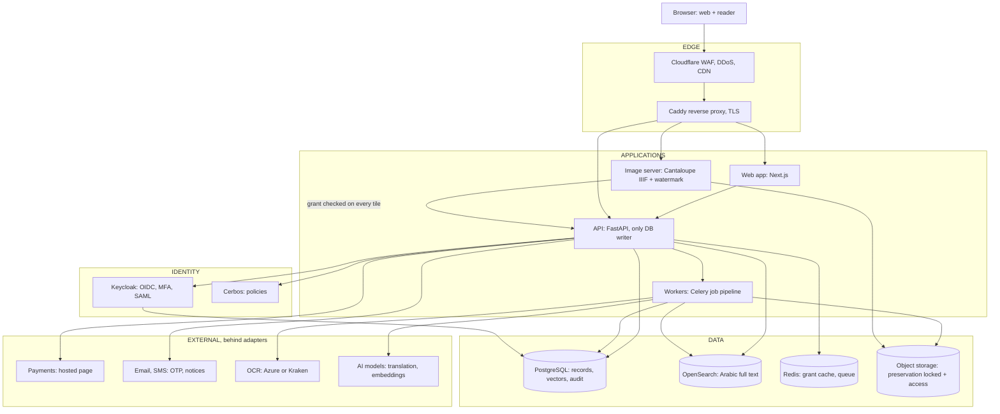

# Jordanian Digital Heritage Platform: Technical Specification

As of October 4, 2026. Owner: Amer Al-Naber.

## How to use this document with Claude Code

This document is the single source of truth for the core layer. It lives at the repository root as `SPEC.md` and is referenced from `CLAUDE.md`. Claude Code treats every requirement here as binding unless a later decision in the repo's `docs/decisions/` folder supersedes it.

Opening prompt for the first session:

```markdown
Read SPEC.md in full before writing any code. Then:
1. Confirm the open decisions in the last section with me before scaffolding.
2. Produce docs/ARCHITECTURE.md and docs/THREAT_MODEL.md from the spec.
3. Scaffold the monorepo per the repository structure section.
4. Implement in the phase order given. Do not start a later phase before the acceptance criteria of the current one pass.
5. For every security requirement, write the test that proves it before the feature.
Ask before deviating from any named standard, library, or security control.
```

Working rules for every session:

- Never commit secrets. All configuration comes from environment variables validated at startup.
- Every endpoint, model, and migration ships with tests. Coverage gate is 80 percent on the API package.
- Every pull request updates `CHANGELOG.md` and, where a design choice was made, adds a one-page ADR to `docs/decisions/`.
- Arabic is a first-class language from the first commit, not a translation pass at the end.
- Protected content never leaves the server as a downloadable original. If a feature needs that, stop and ask.

## Vision and scope

The platform turns a physical Jordanian heritage library into a secure digital destination that a researcher in Tokyo, a student in Karak, and a curator in Amman can all use with confidence. Its guiding line is: Preserve the knowledge. Protect the heritage. Open access to the world.

The platform must read as a cultural institution, not an e-book store. Trust, authenticity, preservation, and national cultural value lead every design decision. The original book and its documented sources are always the authority. Any modern interpretation, summary, or AI-generated visualization is labeled as such and kept visually and structurally separate from the source.

The core layer is the digital library itself. Later layers (the immersive AI reader, the automated scene-generation pipeline, educational products) plug into this layer through its API and are out of scope for this specification.

In scope for the core layer:

- Public discovery: catalog, search, subject browsing, book pages with rich metadata and sample pages
- Identity: registration, verification, roles, and institutional accounts
- Access control: request and approval workflows, paid access, time-limited sessions
- Secure reading: an in-browser reader that shows the scanned page and never hands out the original file, with watermarking and controlled print
- OCR of the whole collection for internal use: search, indexing, translation, and later features. OCR text is never the reading interface
- Two AI features: context-aware translation and context-aware search, both specified in the Core AI features section
- Review portal: every AI-generated object waits in a queue until a reviewer approves it on the platform
- Preservation: a storage layout and metadata model that would satisfy a national library's digitization program
- Administration: cataloging, digitization intake, rights management, approvals, auditing, and analytics
- Full Arabic and English experience with correct bidirectional layout

Non-goals for phase 1:

- No AI-generated visualizations, chat, or summaries. Translation and search are the only AI features in phase 1. The data model reserves room for the rest.
- No mobile native apps. The web platform must be excellent on phones.
- No in-house OCR engine. OCR is a pluggable pipeline step using an external service.
- No marketplace, no third-party sellers, no user-uploaded content.
- No social features beyond private bookmarks and citations.

## Users, roles, and access tiers

Access is decided per book, per user, per time window. A book carries an access class. A user carries a role and verification level. A grant joins the two for a bounded period. Nothing is readable without a grant, and nothing is downloadable at all.

| Role | Who | Verification | Can do |
| --- | --- | --- | --- |
| Visitor | Anyone, no account | None | Browse catalog, search metadata and OCR text, view sample pages, read open-access books |
| Member | Registered individual | Email + phone (OTP) | Everything above, bookmark, cite, request access to restricted books, pay for timed access |
| Verified researcher | Academic, journalist, author | Identity document + affiliation review by staff | Faster approval, longer sessions, request print quota |
| Institutional user | Member of a partner university or library | SSO via institution (SAML or OIDC) | Reads under the institution's license without per-book requests |
| Institution admin | Partner institution's librarian | Staff-provisioned | Manages its own users, sees its usage reports |
| Curator | Library cataloging staff | Staff-provisioned, MFA required | Creates and edits records, manages digitization intake, publishes books |
| Reviewer | Subject expert, translator, or historian appointed by the library | Staff-provisioned, MFA required | Works the review portal: checks every AI-generated object, edits, approves, or rejects. Nothing AI-generated reaches the public without this role's approval |
| Rights officer | Library legal or management | Staff-provisioned, MFA required | Sets access class and pricing, approves or denies requests, revokes grants |
| Platform admin | Technical operator | Staff-provisioned, hardware key MFA | System configuration, user management, audit export, no content bypass without a logged break-glass action |

Access classes for a book:

| Class | Reading | Sample pages | Print | Typical use |
| --- | --- | --- | --- | --- |
| Open | Anyone | All | Watermarked, quota | Public domain works |
| Registered | Members, instant | First 10 pages | Watermarked, quota | Most of the collection |
| Paid | Members after payment, timed | First 10 pages | Watermarked, quota | Library revenue titles |
| Restricted | Approved request only | First 3 pages | Disabled by default | Rare or sensitive material |
| Embargoed | Staff only | Cover and metadata | Disabled | Under rights review |

The roles above map to permissions through a policy engine, never through hard-coded role checks in route handlers. A permission check reads as: can this principal perform this action on this resource under these conditions. Conditions include grant validity, session age, device count, and geographic rules the rights officer sets.

## Functional requirements

Each requirement below carries an ID so Claude Code can trace tests and commits to it. MUST means phase 1 acceptance depends on it. SHOULD means phase 2 unless trivial.

### Catalog and discovery

- CAT-1 MUST: Every book has a public landing page with title, authors, publication details, subjects, description, provenance, a sample page viewer, rights statement, and a persistent citation with a stable URL and DOI-style identifier.
- CAT-2 MUST: Subject browsing by place (governorate, city, site), period, theme, and material type, each with a curated landing page that staff can edit.
- CAT-3 MUST: Collection pages that group books by donor, series, or digitization project.
- CAT-4 MUST: A unified search over metadata and full OCR text with Arabic-aware tokenization, diacritic-insensitive matching, hamza and alef normalization, and stemming. Results show the page thumbnail and page number with the match highlighted on the scan from ALTO coordinates. OCR text itself is never displayed.
- CAT-5 MUST: Faceted filtering on subject, place, period, language, access class, and digitization status. Facets never leak the existence of embargoed titles to the public.
- CAT-6 SHOULD: Related-items recommendations based on shared subjects and co-citation, computed offline, no personalization.
- CAT-7 SHOULD: OAI-PMH endpoint and a sitemap so national and international aggregators can harvest open metadata.

### Identity and accounts

- ACC-1 MUST: Registration with email and phone verification, password policy aligned with NIST SP 800-63B (length over complexity, breached-password check), and optional passkeys.
- ACC-2 MUST: Multi-factor authentication available to all users and enforced for every staff role.
- ACC-3 MUST: Researcher verification flow with document upload, staff review queue, decision with reason, and automatic deletion of uploaded identity documents 30 days after decision.
- ACC-4 MUST: Institutional SSO through OIDC and SAML 2.0, with just-in-time provisioning and group-to-role mapping.
- ACC-5 MUST: Self-service profile, session list with revoke, data export, and account deletion that respects legal retention of audit records.

### Access requests, grants, and payments

- ACS-1 MUST: A member can request access to a Restricted book with a stated purpose. Rights officers see a queue with the requester's verification level and history and decide with a logged reason. The requester is notified by email and in-app.
- ACS-2 MUST: A grant has a start, an end, a maximum concurrent device count, and an optional page range. Grants are revocable at any time and revocation takes effect within 60 seconds on active readers.
- ACS-3 MUST: Paid access creates a grant on successful payment. Pricing is per book and per duration (24 hours, 7 days, 30 days) and staff set it. Payment runs through a hosted payment page from a licensed Jordanian gateway. No card data touches the platform.
- ACS-4 MUST: Institutional licenses define which access classes the institution's users can read and a concurrent-seat limit.
- ACS-5 SHOULD: Reading-room mode, where a visitor physically at the library reads on library devices without an account, bound to the library's network and device certificates.

### Secure reader

- RDR-1 MUST: Pages are served as tiled images through a IIIF Image API endpoint that checks the grant on every tile request. No PDF, EPUB, or full-resolution image is ever sent to a client for protected books.
- RDR-2 MUST: Every served tile carries a visible watermark with the user identifier, timestamp, and book identifier, rendered server-side, and an invisible forensic watermark seeded per session.
- RDR-3 MUST: The reader supports page navigation, zoom, two-page view, rotation, a table of contents, bookmarks, text search within the book, and copying citations. OCR text is never shown, selectable, or copyable in the reader. The scan is the interface, and in-book search highlights regions on the scan.
- RDR-4 MUST: Print is a server-rendered, watermarked, low-resolution PDF of up to a staff-set page quota per grant. Print requests are logged with page numbers.
- RDR-5 MUST: Sessions expire after 30 minutes of inactivity and after the grant's end. The reader re-validates the grant every 60 seconds and blanks on failure.
- RDR-6 MUST: Reader behavior analytics capture page views and dwell time for the audit log, not for advertising.
- RDR-7 SHOULD: Offline reading is not supported. Any cached tiles are short-lived and encrypted in the service worker cache.

### Source and interpretation separation

- SRC-1 MUST: Every content object carries a provenance type (scan, OCR, transcription, translation, editorial note, visualization) and an origin (human or AI). The reader renders each type in a distinct, labeled frame and never blends them in one view.
- SRC-2 MUST: AI-generated objects store the model, prompt reference, generation date, and reviewer. Every AI-generated object enters the review queue on creation and becomes public only after a reviewer approves it in the review portal.
- SRC-3 MUST: Every page in the reader can be cited by stable identifier and the citation points to the original scan, not to any interpretation.

### Administration and curation

- ADM-1 MUST: Digitization intake accepts a batch of page images with a manifest, validates checksums and image specifications, runs OCR through the pipeline, and lands a draft record for curators.
- ADM-2 MUST: Record editor with Dublin Core and MODS-aligned fields, controlled vocabularies for subjects, places, and periods, authority records for people and organizations, and field-level change history, at document level and at page level.
- ADM-3 MUST: Publishing workflow with draft, review, published, and withdrawn states and a required second approver for publishing and for changing an access class.
- ADM-4 MUST: Rights management screen showing, per book, the rights basis, access class, pricing, active grants, and a one-click revoke-all.
- ADM-5 MUST: Audit viewer with search by user, book, action, and time, and signed export to CSV and JSON.
- ADM-6 MUST: Dashboard with catalog size, digitization progress, request volume, approval times, reading activity by country, review queue depth, and revenue.
- ADM-7 SHOULD: Bulk import from MARC 21 and CSV, and export to MARC 21, MODS, and Dublin Core XML.
- ADM-8 MUST: Review portal for the Reviewer role on the same platform behind its own access. A queue of every AI-generated object in `pending` state, filterable by book, language, and type. Side-by-side view of the source scan, the OCR text, and the generated text. Inline editing, approve, or reject with a reason. Assignment to a named reviewer, due dates, and throughput metrics. Approval publishes the object. Rejection sends it back to the pipeline with the reviewer's note attached to the next attempt.

## Content and metadata standards

The platform speaks the standards a national library or a university archive already uses, so its records can be harvested, exchanged, and trusted. The internal model is richer than any single standard and maps out to each.

| Area | Standard | How the platform uses it |
| --- | --- | --- |
| Descriptive metadata | Dublin Core (DCMI Terms) and MODS 3.7 | Internal fields map to both. MODS is the export of record, Dublin Core feeds OAI-PMH and search engines |
| Library exchange | MARC 21 | Import and export for partner libraries and the National Library's catalog |
| Image delivery | IIIF Image API 3.0 and IIIF Presentation API 3.0 | Tiled page delivery and per-book manifests. Manifests for protected books are only issued with a valid grant token |
| Preservation packaging | METS, PREMIS 3 | Each digitized book is a METS package. PREMIS records every preservation event: ingest, fixity check, migration, access |
| Preservation model | OAIS reference model (ISO 14721) | Separate submission, archival, and dissemination packages. Masters are never served directly |
| Transcribed text | ALTO XML for OCR, TEI P5 optional for scholarly transcriptions | ALTO keeps word coordinates for search highlighting. TEI is reserved for later editorial work |
| Identifiers | ARK or DOI through a registered prefix, plus internal UUIDv7 | Every book, page, and collection gets a persistent public identifier. Never expose internal database IDs |
| Authorities | VIAF and Library of Congress authorities where they exist, local authority records otherwise | People, organizations, and places link to authority IDs so names are consistent across the catalog |
| Places | Local gazetteer of Jordanian governorates, cities, and heritage sites with coordinates, linked to GeoNames where possible | Powers place browsing and future map features |
| Languages and scripts | ISO 639-3 and ISO 15924 | Every text object states language and script, including mixed Arabic and Ottoman Turkish material |
| Rights statements | RightsStatements.org vocabulary plus a local rights basis field | Public rights statement on every page, legal basis visible to staff only |
| Dates | EDTF (Extended Date Time Format) | Handles uncertain and approximate dates, Hijri dates stored alongside Gregorian |

### Image and file specifications

| Object | Format | Specification |
| --- | --- | --- |
| Preservation master | Uncompressed TIFF 6.0 or lossless JPEG 2000 | 400 ppi minimum at original size, 24-bit color, embedded ICC profile, color target in first and last capture of each batch |
| Access master | Lossy JPEG 2000 or pyramidal TIFF | Generated from the preservation master, feeds the IIIF server |
| Tiles and thumbnails | WebP with JPEG fallback | Generated on demand and cached, never stored as a complete page set that could be reassembled |
| OCR output | ALTO XML plus plain text per page | Confidence score stored per word, pages under 85 percent average confidence flagged for review |
| Print derivative | PDF generated per request | 150 ppi, watermarked, expires after download, never stored |
| Fixity | SHA-256 per file, recorded at ingest | Scheduled verification quarterly, every failure raises an incident |

### Source versus interpretation labeling

Every content object carries `provenance_type` with one of: `scan`, `ocr`, `transcription`, `translation`, `editorial`, `visualization`, and `origin` with one of `human` or `ai`. The reader renders `scan` as the page. `ocr` is internal and is never rendered to any user. Every other type appears in a secondary panel with a label stating what it is, whether a person or a model produced it, and when. Objects with `origin` equal to `ai` also show the reviewer and the review date. The API refuses to return any `ai` object whose `review_status` is not `approved` to non-staff callers, and the review portal is the only path from `pending` to `approved`.

## Architecture and technology stack

The platform is a modular monolith behind one API, deployed as containers, with the image server and the identity provider as separate services. Every component is open source and self-hostable, so the same build runs on a cloud region today and inside the institution's own data center at handover.



Requests enter through the edge, the API makes every access decision with Keycloak and Cerbos, and the image server serves tiles only after that decision. The API alone writes to PostgreSQL. Workers call OCR and the AI models and write derivatives, vectors, and search documents. The image server reads the access bucket only after the API confirms the grant, cached 60 seconds in Redis.

| Layer | Choice | Why this and not the alternative |
| --- | --- | --- |
| Web frontend | Next.js 15, TypeScript, App Router, Tailwind with custom design tokens, next-intl | Server rendering for SEO and first paint, mature RTL support, the largest pool of components. Remix and SvelteKit are fine but thinner on IIIF and i18n tooling |
| Page viewer | OpenSeadragon with the IIIF plugin | The reference deep-zoom viewer used by national libraries. Mirador is heavier than phase 1 needs |
| API | FastAPI on Python 3.12, SQLAlchemy 2, Alembic, Pydantic v2 | Matches the team's strongest language, first-class async, typed contracts, OpenAPI for free. The same language runs the OCR, translation, and image workers |
| Background jobs | Celery workers with Redis broker | Ingest, OCR, derivatives, embeddings, translation, fixity checks, emails. Celery is boring and documented, which is what a turnkey handover needs |
| Identity | Keycloak 26 | OIDC provider, MFA, passkeys, SAML brokering for institutional SSO, admin console the institution's IT staff already know. Building auth in-house is a security liability |
| Authorization | Cerbos policy engine | Attribute-based decisions (role, grant, time, device count) in versioned YAML policies with a test suite, outside application code. OPA works too but is harder for non-engineers to read |
| Database | PostgreSQL 16 with pgvector | Row-level security for tenant isolation, JSONB for metadata extensions, logical replication for backups. pgvector keeps page embeddings next to the records and inside the same backup, so no separate vector database |
| Search | OpenSearch 2.x with the ICU analysis plugin and a custom Arabic analyzer | Arabic normalization, stemming, highlighting with ALTO coordinates, and faceting in one engine. Meilisearch is simpler but weaker on Arabic morphology and large full-text corpora |
| Language models | Adapter interface with two providers, the Claude API first and a second chosen with the institution, plus a reserved self-hosted option | Translation and query understanding. Only providers with no-training-on-inputs terms. The adapter lets the institution change provider or move on-premises without touching the pipeline |
| Embeddings | Multilingual embedding model behind the same adapter, chosen on the 100-query test set | Cross-lingual semantic search. Model and version recorded per vector so a change triggers a tracked re-embedding |
| Cache and sessions | Redis 7 | Grant validation cache, rate limiting, reader heartbeat, Celery broker |
| Object storage | S3-compatible: MinIO on-premises, AWS S3 or equivalent in cloud | Two buckets: preservation with object lock and versioning, access for derivatives. The API never serves from preservation |
| Image server | Cantaloupe 5 behind an authorizing proxy | Production IIIF Image API 3.0 server, reads JPEG 2000 and pyramidal TIFF, a delegate hook checks the grant on every tile |
| Watermarking | pyvips for visible marks, a seeded spread-spectrum library for invisible marks | Applied in the tile path, per request, never stored |
| OCR | Adapter interface with Azure AI Document Intelligence as the first provider, Kraken as the self-hosted option for manuscripts | Arabic print OCR quality is far better from commercial services. Kraken covers historic scripts when the collection needs it. OCR output is internal only |
| Payments | Adapter interface with a licensed Jordanian gateway (HyperPay or PayTabs) as the first provider, CliQ for local transfers | Stripe does not operate in Jordan. Hosted payment pages keep the platform out of PCI DSS scope |
| Messaging | SMTP provider for email, a Jordanian SMS gateway for OTP | Both behind adapters |
| Edge | Cloudflare (WAF, DDoS, bot management, CDN for public assets only) in front of Caddy as reverse proxy | Protected tiles bypass the CDN cache. Caddy gives automatic TLS and simple config. Bot rules allow named AI crawlers on public paths and block them on the reader |
| Observability | OpenTelemetry to Grafana Loki, Tempo, and Prometheus, Sentry for errors | Traces follow a request from tile to grant check, which audits need |
| Runtime | Docker Compose for development and the pilot, Kubernetes (k3s) manifests for production | One `compose up` runs the whole stack locally. k3s is light enough for a single institution's servers |

The API is the only writer to the database. The web app calls the API through typed clients generated from the OpenAPI schema. The image server reads the access bucket directly but asks the API for a grant decision on every manifest and tile request, cached in Redis for 60 seconds.

## Data model, storage layout, and preservation

The model separates the intellectual work, its physical and digital manifestations, the people who use them, and the record of who did what. All primary keys are UUIDv7. All tables carry `created_at`, `updated_at`, `created_by`, and soft-delete `deleted_at` where deletion is ever allowed. Audit tables are append-only.

### Core entities

| Entity | Purpose | Key fields |
| --- | --- | --- |
| `work` | The intellectual book, independent of copies | public identifier, title (Arabic, transliterated, English), uniform title, language, script, date (EDTF, Hijri, Gregorian), description, subjects, places, periods, rights statement, access class, pricing, publish state |
| `agent` | Person or organization in any role | authority ID, name forms in Arabic and Latin, dates, role links to works |
| `item` | A physical copy held by the library | shelfmark, condition, provenance, donor, digitization status |
| `digital_object` | One digitized copy of an item | METS package reference, page count, ingest batch, fixity status |
| `page` | One scanned page, its own metadata, and its text | See the page-level metadata list below |
| `content_object` | Any secondary content attached to a work or page | `provenance_type`, `origin`, language, body or reference, model and prompt reference when AI-generated, `review_status`, reviewer, reviewed at, source page link |
| `review_task` | One item in the reviewer queue | content object link, state (`pending`, `in_review`, `approved`, `rejected`), assignee, due date, reviewer note, attempt number |
| `glossary_term` | A name, place, or technical term with its approved translation | source form, approved target forms per language, context note, linked authority or vocabulary term |
| `page_embedding` | Vector for semantic search | page link, chunk index, embedding (pgvector), model and version |
| `collection` | Curated grouping | title, description, editorial order, cover work |
| `vocabulary_term` | Controlled subject, place, or period | scheme, preferred labels, broader and narrower links, coordinates for places |
| `user` | Platform principal | Keycloak subject ID, role, verification level, institution link, preferences |
| `institution` | Partner organization | license terms, seat limit, SSO configuration, IP ranges for reading-room mode |
| `access_request` | A request for a Restricted work | requester, work, purpose, state, decision, decided by, reason |
| `grant` | Permission to read | user or institution, work, start, end, device limit, page range, source (request, payment, license, staff), revoked flag |
| `payment` | Record of a transaction | gateway reference, amount, currency, status, grant link, never any card data |
| `audit_event` | Immutable log line | actor, action, resource, outcome, IP, user agent, request ID, hash chain to previous event |

### Page-level metadata

The document has its metadata and every page has its own. The page record is where the scan and the OCR text live, and it is the unit for search hits, translation, citation, and review.

- Identity: page UUID, public identifier (work identifier plus sequence), sequence number, printed page label, physical folio reference
- Scan: preservation master key, access derivative key, pixel dimensions, capture date, capture device, color target reference, condition notes (tears, stains, missing text)
- Classification: page type (cover, title, blank, text, illustration, map, table, colophon, endpaper), language and script detected on the page, reading direction
- Text: OCR plain text, ALTO XML reference, average and minimum word confidence, OCR engine and version, OCR date, correction state (raw, corrected, verified)
- Structure: chapter or section the page belongs to, table of contents entry, running head
- Links: approved translations per language, approved transcriptions, editorial notes, review tasks
- Preservation: SHA-256 of master and derivative, last fixity check, PREMIS events

Page metadata is editable by curators at page level and in bulk, and every change is versioned.

### Storage layout

```text
preservation/            object lock enabled, versioning on, API has no write credential
  {work_id}/{digital_object_id}/
    mets.xml
    master/{page_seq}.tif
    checksums.sha256
access/                  versioned, derivatives only
  {work_id}/{digital_object_id}/
    jp2/{page_seq}.jp2
    alto/{page_seq}.xml
    thumb/{page_seq}.webp
    sample/{page_seq}.webp   only pages in the public sample range
uploads/                 30-day lifecycle rule, encrypted, identity documents only
exports/                 24-hour lifecycle rule, audit exports and print PDFs
```

### Preservation rules

- Ingest writes the preservation master once through a dedicated ingest credential. No other service holds write access to that bucket.
- Every file's SHA-256 is recorded at ingest and verified quarterly by a scheduled worker. A mismatch opens an incident and freezes the digital object from public view.
- Derivatives are regenerable. Losing the access bucket loses nothing permanent.
- The METS package plus the PostgreSQL export must be enough to rebuild the platform on new software. Test this restore once per quarter.
- PREMIS events are written for ingest, fixity check, derivative generation, access class change, and withdrawal.
- Preservation masters are replicated to a second region or a second site with its own credentials. One copy is on cold storage.

## Security requirements

The platform targets OWASP ASVS 4.0 Level 2 across the board and Level 3 for authentication, session management, and access control. The threat model assumes a motivated individual trying to extract a full book, a compromised staff account, and a hostile network. Every control below has an ID and a test.

### Identity and sessions

- SEC-1: All authentication goes through Keycloak with OIDC Authorization Code flow and PKCE. The API never sees a password.
- SEC-2: Access tokens live 10 minutes, refresh tokens 8 hours for members and 1 hour for staff, with rotation and reuse detection. Reader sessions additionally require a grant token bound to the user, work, and device fingerprint.
- SEC-3: MFA is mandatory for every staff role and available to members. Platform admins use hardware keys (WebAuthn). SMS OTP is allowed for members only.
- SEC-4: Account lockout after 10 failed attempts with exponential backoff, and breached-password checks against a k-anonymity API at registration and password change.
- SEC-5: A user sees every active session and device and can revoke each. Staff can revoke any user's sessions. Revocation propagates within 60 seconds through the Redis grant cache.

### Authorization

- SEC-6: Every API route calls the policy engine with principal, action, resource, and context. There is no route that skips the check, enforced by a test that walks the router and fails on any unannotated handler.
- SEC-7: PostgreSQL row-level security isolates institutional data and restricts staff queries to their role's scope.
- SEC-8: Break-glass access for platform admins to protected content exists, requires a second admin's approval, expires in 1 hour, and writes a high-severity audit event that emails the rights officer.
- SEC-9: Changes to access class, pricing, or a grant's end date require a second approver (four-eyes).

### Content protection

- SEC-10: Protected originals are never served. Only tiles through the authorizing image server, each tile request validated against the grant. Tile URLs carry a short-lived signed token, 5 minutes, bound to the session.
- SEC-11: Visible and forensic watermarks on every protected tile and every print PDF, with the user ID, grant ID, and timestamp. The forensic key per session is stored so a leaked page can be traced.
- SEC-12: Rate limits per user and per IP on tile requests, sized to normal reading speed (sliding window, roughly 3 pages per second burst, 600 tiles per minute sustained). Exceeding limits suspends the session and flags the account.
- SEC-13: The reader disables right-click and selection where the browser allows and sets a strict Content Security Policy. These are deterrents, not controls. The real control is that nothing worth stealing is ever delivered.
- SEC-14: Public samples and open-access books are also watermarked with the platform mark so provenance travels with every image.
- SEC-15: Signed URLs for any object download (exports, print PDFs) expire in 15 minutes and are single-use.

### Application security

- SEC-16: Strict CSP with nonces, no inline scripts, HSTS with preload, X-Content-Type-Options, Referrer-Policy strict-origin-when-cross-origin, COOP and COEP where the viewer allows.
- SEC-17: All input validated by Pydantic schemas at the API edge. Output encoding by the framework. Parameterized queries only. File uploads checked by magic bytes, size, and image dimensions, then re-encoded.
- SEC-18: Dependencies pinned with lockfiles, scanned on every pull request (pip-audit, npm audit, Trivy on images), and a monthly update window.
- SEC-19: Secrets live in the host's secret store (Docker secrets or Kubernetes secrets backed by SOPS or Vault), never in environment files committed to git. Keys rotate yearly or on any suspected exposure.
- SEC-20: Static analysis (Semgrep with the OWASP ruleset, Bandit, ESLint security plugin) blocks merges. A DAST scan (OWASP ZAP) runs against staging weekly.
- SEC-21: An independent penetration test before the first public launch and after any change to the reader or the authorization layer.

### Encryption

- SEC-22: TLS 1.2 minimum, TLS 1.3 preferred, modern cipher suites only, certificates automated.
- SEC-23: Encryption at rest for every data store: database volumes, object storage buckets with server-side encryption, backups with a separate key. Identity document uploads use a dedicated key and are deleted 30 days after decision.
- SEC-24: Internal service traffic runs over mutual TLS or an encrypted private network. No service is reachable from the internet except through the reverse proxy.

### Auditing and monitoring

- SEC-25: Every read of a protected page, every authorization decision, every admin action, every login, and every grant change writes an audit event. Events are hash-chained and shipped to write-once storage daily.
- SEC-26: Alerts on failed login spikes, tile rate-limit hits, break-glass use, fixity failures, and any policy engine error. Alerts page a named on-call.
- SEC-27: Audit retention is 7 years. Personal data retention follows the compliance section. Logs never contain tokens, passwords, or full identity document data.

### Compliance

- SEC-28: Jordan Personal Data Protection Law No. 24 of 2023 governs by default: lawful basis recorded per data category, consent for marketing only, a data protection contact, breach notification within the law's window, and user rights to access, correct, and delete.
- SEC-29: GDPR for users in the EU and UK: the same rights, a privacy notice in English and Arabic, and data processing records. International transfers of preservation data are not personal data and are not restricted.
- SEC-30: PCI DSS scope is avoided entirely through hosted payment pages. The platform stores only the gateway's transaction reference.
- SEC-31: The controls above are mapped to ISO 27001 Annex A in `docs/COMPLIANCE_MATRIX.md` so an institution's auditor can trace each one.

## Hosting, infrastructure, and deployment

The build must run identically in three places: a developer laptop, a rented cloud environment for the pilot, and the institution's own servers after handover. Infrastructure is code from day one, in `infra/`, and nothing is configured by hand.

### Environments

| Environment | Where | Purpose | Data |
| --- | --- | --- | --- |
| Local | Docker Compose on a laptop | Development, one command brings up every service with seed data | Synthetic books only |
| Staging | Same topology as production, smaller sizes | Integration tests, DAST, user acceptance with the institution | Masked copy of production metadata, sample scans |
| Pilot | One cloud region with a Jordanian or regional presence, or the institution's data center | First real users, first real books | Real |
| Production | Institution's choice at handover: its own data center on k3s, or a sovereign cloud region | Public launch | Real |

The pilot runs on a single managed Kubernetes cluster or two virtual machines (application and data), whichever the budget allows. Cloudflare sits in front in both cases. The region decision belongs to the institution because the content is a national asset. The platform must not depend on any cloud-specific service beyond S3-compatible storage, so the move from cloud to on-premises is a data copy, not a rewrite.

### Sizing for the pilot

| Component | Pilot size | Notes |
| --- | --- | --- |
| Application node | 4 vCPU, 16 GB | Web, API, workers, Keycloak, Cerbos |
| Data node | 4 vCPU, 16 GB, 500 GB SSD | PostgreSQL, OpenSearch, Redis, Cantaloupe |
| Object storage | 2 TB to start | 1,000 books at 300 pages at roughly 50 MB per master page needs about 15 TB for masters alone, so budget storage by the digitization plan, not by the app |
| Bandwidth | 1 TB per month | Tiles are small, masters never leave |

### Deployment

- Every merge to `main` builds signed container images, runs the full test suite, deploys to staging, and runs smoke tests.
- Production deploys are tagged releases, deployed by a human-approved pipeline step, with a rollback that is one command and tested monthly.
- Database migrations run forward only, are reversible by a documented script, and are tested against a masked production copy before release.
- Blue-green or rolling deployment so the reader never drops a session during a release.
- Configuration is validated at startup and the service refuses to boot with a missing or insecure setting.

### Backups and recovery

| Data | Method | Frequency | Retention | Target restore time |
| --- | --- | --- | --- | --- |
| PostgreSQL | WAL archiving plus daily base backup to object storage in a second location | Continuous | 90 days point-in-time, yearly snapshots 7 years | 1 hour |
| Preservation bucket | Cross-region replication plus a quarterly offline copy | Continuous | Forever | 24 hours for full re-sync |
| Access bucket | Regenerable from masters, replicated for convenience | Daily | 30 days | Regenerate in background |
| OpenSearch | Rebuilt from PostgreSQL and ALTO files | Not backed up | None | 4 hours for a full reindex |
| Keycloak | Database inside the PostgreSQL backup plus realm export | Daily | 90 days | 1 hour |
| Audit log | Shipped daily to write-once storage | Daily | 7 years | 1 hour |

Restore drills run quarterly and the result is recorded in `docs/operations/restore-drills.md`. The institution's IT team runs the drill themselves before handover is accepted.

### Operations handover

- A runbook per service: start, stop, upgrade, rotate secrets, common failures.
- A monitoring dashboard the institution can read without engineering help: uptime, active readers, queue depth, storage growth, fixity status.
- Named owners and an escalation path for each severity level.
- A capacity plan that projects storage and cost per 1,000 books digitized.

## Internationalization, accessibility, performance, and SEO

Arabic is the primary language and English is the second. Both are complete at every release. The interface direction follows the interface language, and the content direction follows the content language, so an Arabic book in the English interface still reads right to left inside the reader.

### Arabic and bidirectional text

- INT-1: Every string is externalized from day one through next-intl with ICU message syntax for plurals and gender. No hard-coded user-facing text.
- INT-2: Layout uses CSS logical properties (`margin-inline-start`, not `margin-left`) and `dir` attributes on the root and on every content container, so mirroring is automatic.
- INT-3: Arabic typography is set with a text face chosen for long reading and a display face for headings, both with proper kashida and ligature support. Latin and Arabic faces are paired for matching x-height and weight.
- INT-4: Numerals follow the locale setting, Eastern Arabic or Western, as a user preference. Dates show Gregorian with Hijri on heritage dates.
- INT-5: Search handles Arabic as the content standards section specifies, and the query box accepts either script for names and places.
- INT-6: Transliteration fields use a documented scheme (ALA-LC) so Latin-script searches hit Arabic records.
- INT-7: Slugs and URLs use the public identifier, not the title, so links are stable across languages.

### Accessibility

- ACX-1: WCAG 2.2 Level AA across the public site and the reader, verified by automated checks (axe) in CI and a manual screen-reader pass on each release.
- ACX-2: The reader is fully keyboard-operable: page turn, zoom, search, bookmarks, and citation copy without a mouse.
- ACX-3: Screen readers get the page label, the record metadata, and a short page description where curators write one. OCR text stays internal, so scanned pages do not carry a full text alternative. Record this as a documented accessibility limitation and revisit it with the institution.
- ACX-4: Color contrast of at least 4.5 to 1 on text, visible focus states, no information carried by color alone, motion reduced when the user prefers it.
- ACX-5: Forms give errors in text next to the field, in the interface language, and never rely on a captcha that blocks assistive technology without an alternative.

### Performance

- PRF-1: Core Web Vitals targets on a mid-range phone over 4G: LCP under 2.5 seconds, INP under 200 milliseconds, CLS under 0.1, measured on the catalog, a book page, and the reader.
- PRF-2: First tile of a page visible within 1 second of a page turn on a warm session.
- PRF-3: Search results under 500 milliseconds at the 95th percentile for a 100,000-page corpus.
- PRF-4: Public pages are server-rendered and cached at the edge for 5 minutes. Protected and personalized responses carry `Cache-Control: private, no-store`.
- PRF-5: Images use responsive sizes and modern formats, fonts are subset per script and preloaded, JavaScript for the catalog stays under 150 KB compressed.

### SEO and discoverability

- SEO-1: Every public book, collection, and subject page has server-rendered metadata, Open Graph tags, and Schema.org `Book`, `CollectionPage`, and `Dataset` structured data with `inLanguage`, `isAccessibleForFree`, `license`, and `citation`.
- SEO-2: `hreflang` alternates between Arabic and English for every public page, a sitemap index split by type, and clean canonical URLs.
- SEO-3: Public sample pages are indexable with image metadata. Protected pages return 401 to crawlers and are excluded from sitemaps.
- SEO-4: An OAI-PMH endpoint and a Schema.org dataset description so national aggregators and research portals can harvest the catalog.
- SEO-5: AI crawlers are welcome on open metadata. `robots.txt` explicitly allows the major AI crawlers (GPTBot, ClaudeBot, Google-Extended, PerplexityBot, and others as they appear) on catalog, book, collection, and subject pages, and disallows them on reader, account, and admin paths. A root `llms.txt` describes the collection, the open API, and the citation format in plain text.
- SEO-6: An open, unauthenticated, rate-limited JSON API publishes every public record's metadata, including page labels, subjects, places, periods, rights statement, and citation, in Dublin Core and Schema.org shapes, plus a bulk export file regenerated nightly. OCR text and scans of protected books are never part of this feed. Open-access books may expose sample page images through IIIF manifests.
- SEO-7: Every public page carries a machine-readable citation block and a persistent identifier, so a model or a search engine that quotes the record can point users back to the platform.

## Visual identity and UX direction

The platform should feel like walking into a serious archive that happens to be beautifully lit. Editorial, quiet, confident, timeless. It borrows from the reading room, the printed catalog, and the museum label, not from app stores or online shops. Claude Code reads the frontend-design skill before building any interface and records the chosen direction in `docs/DESIGN.md` with the tokens below filled in.

### Principles

- The book is the hero. Page images get the most space and the most care. Interface recedes.
- Typography carries the identity. Generous measure, strong hierarchy, real Arabic type set with care, Latin paired to it rather than the other way around.
- Color comes from the material: stone, parchment, ink, oxidized bronze, a single deep accent drawn from Jordanian landscape or textile. No gradients, no neon, no glassmorphism.
- Density is editorial, not dashboard. Whitespace and rules do the structuring. Cards are rare and borders are hairlines.
- Motion is minimal and purposeful: a page turn, a fade on a tile load, nothing decorative.
- Labels are honest. Every piece of content says what it is: original scan, transcription, editorial note, AI-generated. The label system is part of the visual identity.

### What to avoid

- Generic SaaS layouts: hero banner, three feature cards, testimonial strip, pricing table.
- Stock photography, 3D renders, abstract futurism, glowing lines, particle effects.
- E-commerce patterns: add to cart, star ratings, countdown timers, sale badges.
- Default framework typography and default Tailwind palette. The tokens must be chosen, not inherited.
- Icons as decoration. Icons appear only where they replace a word the user already knows.

### Design tokens to define in code

| Token group | Decision to make | Guidance |
| --- | --- | --- |
| Arabic text face | One face for long reading, one for display | Candidates with strong Naskh reading quality and a full weight range. Verify kashida and ligatures in the browser before committing |
| Latin text face | A serif paired to the Arabic text face | Match x-height and stroke contrast. Test mixed-script lines in catalog records |
| Interface face | One sans for controls and metadata labels, with Arabic and Latin in the same family | Keeps forms and menus quiet |
| Palette | Background, surface, ink, muted ink, hairline, one accent, one warning for rights notices | Define in OKLCH, derive light and dark themes from the same hues |
| Type scale | 7 steps, fluid between phone and desktop | Reading text at 18 px minimum on desktop |
| Spacing | 8-point grid, section rhythm on multiples of 64 | |
| Radius | 2 px on controls, 0 on images and frames | Archival objects are not rounded |
| Elevation | None, except the reader's floating toolbar | Flat surfaces separated by hairlines |

### Key screens

| Screen | Purpose | Notes |
| --- | --- | --- |
| Home | State the mission, show the collection's breadth, invite search | A large search field, a few curated entry points, a short statement of trust and preservation. No slideshow |
| Catalog and search | Find a work fast | Results as an editorial list with cover, title in both scripts, date, place, access badge. Facets in a quiet side rail |
| Book page | Decide whether and how to access | Cover, full record, provenance, rights, sample viewer, one clear access action whose label changes with the user's state |
| Reader | Read without friction, without extraction | Full-bleed page, toolbar that hides, side panel for contents, search, and labeled secondary content |
| Request and approval | Ask for and grant access | A form that explains why the material is restricted, and a staff queue that shows the requester's history |
| Review portal | Check AI-generated content | Scan, OCR text, and generated text side by side, inline edit, approve or reject, queue with assignment and due dates |
| Admin | Catalog, rights, audit | Dense, keyboard-friendly, tables with saved views, never pretty at the expense of speed |

## Quality, testing, CI/CD, and repository structure

One monorepo, one `compose up`, one pipeline. Claude Code scaffolds exactly this layout in the first session and keeps it.

```text
/
  CLAUDE.md                  working rules, points to SPEC.md
  SPEC.md                    this document
  README.md
  CHANGELOG.md
  docker-compose.yml         full local stack with seed data
  .env.example               every variable, documented, no real values
  apps/
    web/                     Next.js, TypeScript
    api/                     FastAPI
    worker/                  Celery tasks: ingest, ocr, derivatives, embeddings, translation, fixity, mail
  packages/
    schemas/                 shared OpenAPI-generated TypeScript client and Pydantic models
    design-tokens/           tokens as JSON, built to CSS variables and Tailwind config
    metadata/                Dublin Core, MODS, MARC, METS, PREMIS mappers and validators
    ai-adapters/             OCR, language model, and embedding provider interfaces and implementations
  policies/                  Cerbos policies and their tests
  infra/
    compose/                 per-environment overrides
    k8s/                     k3s manifests, Kustomize overlays
    keycloak/                realm export, theme
    cantaloupe/              config and the grant delegate
    opensearch/              index templates and the Arabic analyzer
  docs/
    ARCHITECTURE.md
    THREAT_MODEL.md
    DESIGN.md
    COMPLIANCE_MATRIX.md
    decisions/               ADR-0001-stack.md and onward
    operations/              runbooks, restore drills
  tests/
    e2e/                     Playwright, both languages, both themes
    load/                    k6 scripts for reader and search
    search-eval/             the 100-query regression set
```

### Testing

| Level | Tool | Gate |
| --- | --- | --- |
| Unit, API | pytest with async support, factory fixtures, a database per test | 80 percent line coverage on `apps/api` |
| Unit, web | Vitest and Testing Library | Every component with logic has a test |
| Policy | Cerbos test suite | Every role and access class combination has a case, including denials |
| Contract | Schemathesis against the OpenAPI schema | No endpoint accepts malformed input silently |
| Integration | Compose stack in CI, real PostgreSQL, OpenSearch, Redis, MinIO | Ingest a seed book, OCR with a mock provider, read it through the real image server |
| End to end | Playwright | Register, verify, request, approve, pay with the gateway's sandbox, read, print, revoke, in Arabic and English |
| Security | Semgrep, Bandit, ESLint security, pip-audit, npm audit, Trivy, ZAP baseline on staging | Any high finding blocks merge |
| Accessibility | axe in Playwright, manual screen-reader checklist per release | No serious violations |
| Load | k6: 500 concurrent readers, 50 tiles per second each, search at 20 queries per second | Targets in the performance section hold |
| Route coverage | A custom test that walks every API route and asserts a policy check | Zero unprotected routes |
| Search relevance | The 100-query set with expected pages | No regression against the last release |
| AI gating | A test that creates an `ai` object and asserts it is invisible to non-staff until approved | Zero leaks |

### Pipeline

1. Lint and type-check (ruff, mypy, ESLint, tsc).
2. Unit and policy tests in parallel.
3. Build images, scan them.
4. Integration and contract tests against the compose stack.
5. End-to-end tests against the built images.
6. Deploy to staging on `main`, run ZAP baseline and smoke tests.
7. Tagged release to production after a human approval step, with automatic rollback on failed health checks.

### Conventions

- Conventional Commits, squash merges, protected `main`, required reviews from one other engineer.
- Python: ruff for lint and format, mypy strict, Pydantic models for every boundary.
- TypeScript: strict mode, no `any`, ESLint with the Next.js and security plugins, Prettier.
- Every public API change bumps the OpenAPI version and regenerates `packages/schemas`.
- Seed data: a fictional Jordanian book of 40 pages with synthetic scans and OCR, used by every test and every demo, so no real material is ever in a test fixture.

## Core AI features

Two AI features ship in the core layer: context-aware translation and context-aware search. Both read the OCR text and the metadata internally, both anchor every output to a scanned page, and every generated text passes through the review portal before anyone outside staff sees it. The detailed translation specification is still to be written with the team. The requirements below are the frame it will fill.

### AI translation

- TRN-1 MUST: Translation runs as a pipeline job per work, never per isolated page. The model receives the work's metadata, the glossary, the chapter structure, the previous and next pages, and the already-approved translations of earlier pages, so terminology and register stay consistent across the book.
- TRN-2 MUST: A glossary of names, places, tribes, titles, dates, and technical terms with approved target forms, seeded from authority records and the gazetteer and grown by reviewers. The pipeline uses approved glossary forms and flags any term it translated without one.
- TRN-3 MUST: Output is page-aligned and segment-aligned to the OCR text, so a reviewer sees the scan region, the OCR line, and the translated line together, and the reader highlights the matching region on the scan.
- TRN-4 MUST: Every translation is a content object with origin `ai`, model and version, prompt template version, glossary version, and a self-assessment score, created at `pending`. Rejected translations retry with the reviewer's note in context, up to a staff-set limit, then escalate to a human translator.
- TRN-5 MUST: Phase 1 scope is Arabic to English for page text and for metadata fields (title, description, subjects). Other directions, including historic Arabic to modern Arabic, are configured later through the same adapter.
- TRN-6 MUST: The model provider sits behind an adapter with at least two implementations. No page text goes to a provider that trains on inputs.
- TRN-7 SHOULD: Reviewer edits feed back as examples for later pages of the same work and as glossary candidates.
- TRN-8 OPEN: Register and style rules (literal versus readable, poetry, Quranic quotations, honorifics, dates), evaluation method, and acceptance thresholds. To be specified with the team before Phase 3.

### Context-aware search

- SRCH-1 MUST: Hybrid retrieval. Lexical search in OpenSearch with the Arabic analyzer and semantic search over page-chunk embeddings in pgvector, fused by reciprocal rank fusion. Metadata fields carry more weight than OCR body text.
- SRCH-2 MUST: Query understanding. The query is matched against authority records, the gazetteer, and the vocabularies, so a search for a city finds its historic names and a search for a period finds Hijri and Gregorian forms.
- SRCH-3 MUST: Cross-lingual queries. An English query finds Arabic pages and the reverse, through multilingual embeddings and approved translations where they exist.
- SRCH-4 MUST: Results are works and pages, never text. Each hit shows the work, the page thumbnail, the page number, and the matched region drawn on the scan from ALTO coordinates. Protected pages outside the sample range show the hit position without the scan until the user holds a grant.
- SRCH-5 MUST: Scope control. Search inside one work, inside a collection, or across the catalog, with the catalog's facets.
- SRCH-6 MUST: Embeddings are computed by a worker at ingest and after OCR correction, with model and version recorded, so a model change triggers a tracked re-embedding job.
- SRCH-7 SHOULD: Anonymous query logs feed a monthly relevance review, and a curated set of 100 test queries with expected pages runs in CI as a regression gate.
- SRCH-8 OUT OF SCOPE: Generated answers, chat, or summaries over the collection. Search returns pages.

### Review queue rules

- REV-1 MUST: Every object with origin `ai` is created at `pending` and is invisible outside the review portal. No code path sets `approved` except the portal action by a Reviewer.
- REV-2 MUST: Reviewers see the scan, the OCR text, and the generated text side by side, edit in place, and approve or reject with a reason. Edits are stored as a diff against the generated version for audit and for pipeline feedback.
- REV-3 MUST: Queue management: assignment, due dates, priority by work, and a dashboard of pending, in review, approved, and rejected counts with median time to approval.
- REV-4 MUST: Approval, rejection, and every edit write an audit event carrying the reviewer identity.

## Delivery phases and acceptance criteria

Five phases, each gated by tests that pass in CI and a demo the team can show a prospective institution. Phase 0 and 1 together are the POC the team needs for its contacts. Durations are estimates for one engineer driving Claude Code part-time and will move.

| Phase | Duration | Builds | Gate |
| --- | --- | --- | --- |
| 0 Foundation | about 1 week | Monorepo, CI, auth, policies, seed book | Stack up, seed ingested, zero unprotected routes |
| 1 Catalog + reader | about 3 weeks | Search, book pages, watermarked tiles | Register, find, read, print, audit, both languages. This is the demo |
| 2 Rights + pay | about 3 weeks | Requests, grants, gateway, SSO | Request to grant to revoke, paid grant expires on schedule |
| 3 Preserve + AI | about 4 weeks | METS, MARC, fixity, translation, review portal, hybrid search | 10-book batch, fixity alarm trips, translation reviewed and shown |
| 4 Handover | about 2 weeks plus external testing | Pen test, load test, restore drill, k3s | Institution restores it alone |

### Phase 0: Foundation (about 1 week)

Scaffold the monorepo, compose stack, CI pipeline, Keycloak realm, Cerbos policies, database schema, design tokens, and the seed book. Accept when `compose up` brings up every service, the seed book is ingested through the real pipeline with a mock OCR provider, and the route-coverage test passes with zero routes.

### Phase 1: Public catalog and secure reader (about 3 weeks)

Catalog, search, subject browsing, book pages, registration with MFA, Open and Registered access classes, the full reader with watermarked tiles, print quota, and audit events. Accept when a new user can register in Arabic, find the seed book by a word in its OCR text, read it with a visible watermark carrying their ID, print 2 pages, and every one of those actions appears in the audit viewer. End-to-end suite green in both languages. This phase is the demo.

### Phase 2: Rights, requests, and payments (about 3 weeks)

Restricted and Paid classes, request and approval queue, four-eyes approvals, grants with device limits and revocation, payment gateway sandbox, institutional SSO with one test identity provider, rights management screens. Accept when a request flows from member to rights officer to grant to reader to revocation, and a sandbox payment creates a timed grant that expires on schedule.

### Phase 3: Preservation, curation, and AI features (about 4 weeks)

METS and PREMIS packaging, fixity scheduling, MARC and MODS import and export, OAI-PMH, open metadata API and AI crawler rules, authority records, vocabularies, bulk intake with manifest validation, dashboards. Then the translation pipeline with glossary, the review portal, and hybrid search with the 100-query regression set. Accept when a batch of 10 books ingests from a manifest, exports valid MODS and MARC that a validator accepts, a deliberately corrupted master trips the fixity alarm and hides the book, and a translated chapter flows from pipeline to pending to approved and appears in the reader labeled as AI-generated and reviewed.

### Phase 4: Hardening and handover (about 2 weeks plus external testing)

Penetration test and remediation, load test to target, accessibility audit, restore drill, runbooks, compliance matrix, k3s manifests proven on a clean server, institution IT training. Accept when the institution's team restores the platform from backups on their own hardware without the development team present.

An implementation ending in Phase 1 is still a complete, demonstrable product. Nothing in later phases requires rework of earlier ones because the access class and grant model exist from Phase 0.

## Open decisions to confirm before the first session

Claude Code asks these in its first message and records the answers as ADR-0001. Defaults are what the specification assumes.

- [ ] Product and repository name. Default: `turath-platform` as a working name, to be replaced by the brand.
- [ ] Pilot hosting target: a cloud region now and on-premises at handover, or on-premises from the start. Default: cloud for the pilot.
- [ ] Which institution's catalog conventions to mirror first (MARC 21 export profile, subject vocabulary). Default: generic MARC 21 with Library of Congress subject headings plus a local Arabic vocabulary.
- [ ] Payment gateway: HyperPay, PayTabs, or another licensed Jordanian provider. Default: build the adapter against HyperPay's sandbox.
- [ ] OCR provider for the pilot: Azure AI Document Intelligence or Google Document AI. Default: Azure.
- [ ] Language model providers for the translation and search adapter. Default: Claude API first, second provider chosen with the institution.
- [ ] Embedding model. Default: a multilingual model with strong Arabic results, decided by the 100-query test set in Phase 3.
- [ ] Translation specification session (TRN-8): register, style rules, evaluation, thresholds. Default: scheduled before Phase 3 starts.
- [ ] Reviewer staffing: how many reviewers, how many hours per week. This sets how many books can carry translations, so it is a business decision, not a technical one.
- [ ] Persistent identifier scheme: ARK through a registered name assigning authority, or DOI through a registration agency. Default: ARK, lower cost and no per-item fee.
- [ ] Whether phase 1 includes the Paid access class or defers it to phase 2 with Restricted. Default: defer, keep the demo focused on reading quality.
- [ ] Researcher verification: which identity documents are accepted and who on the library side reviews them. Default: passport or national ID, reviewed by a rights officer.
- [ ] Reading-room mode in scope for the pilot or not. Default: not.
- [ ] Arabic and Latin typeface choices, decided after rendering three candidate pairings with real catalog records. Default: decide in Phase 0 and record in `docs/DESIGN.md`.
- [ ] The seed book: an original fictional text written for the project, or a public-domain Jordanian text the team is certain is free of rights. Default: fictional, to avoid any question in a demo.
- [ ] Audit retention and personal data retention periods, confirmed against the institution's legal counsel. Default: 7 years audit, 30 days for identity documents, 2 years for inactive member accounts.

### Known risks the specification does not solve

- Screen capture of a displayed page cannot be prevented in a browser. Watermarks make leaks traceable, not impossible. Say this plainly to the institution.
- Arabic OCR on historic or degraded print will need human correction for search and translation to be reliable. Budget curator time per book.
- Translation throughput is set by reviewer capacity, not by the model. A queue that grows faster than reviewers clear it means translations never reach the public.
- Keeping OCR text internal removes the text alternative screen-reader users rely on for scanned pages. Decide with the institution whether that stands.
- Institutional procurement timelines will be longer than build timelines. The POC exists to shorten the first one.
