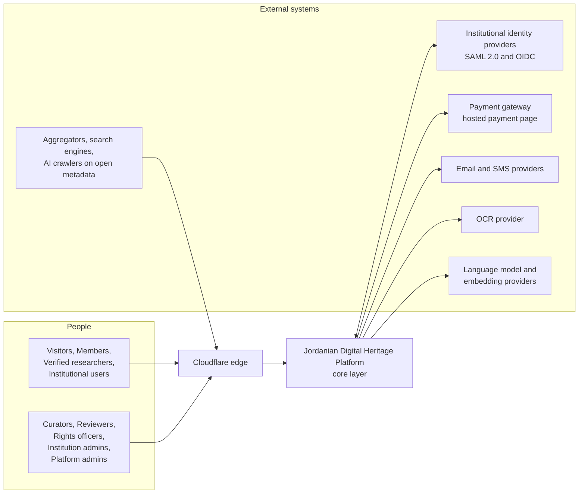
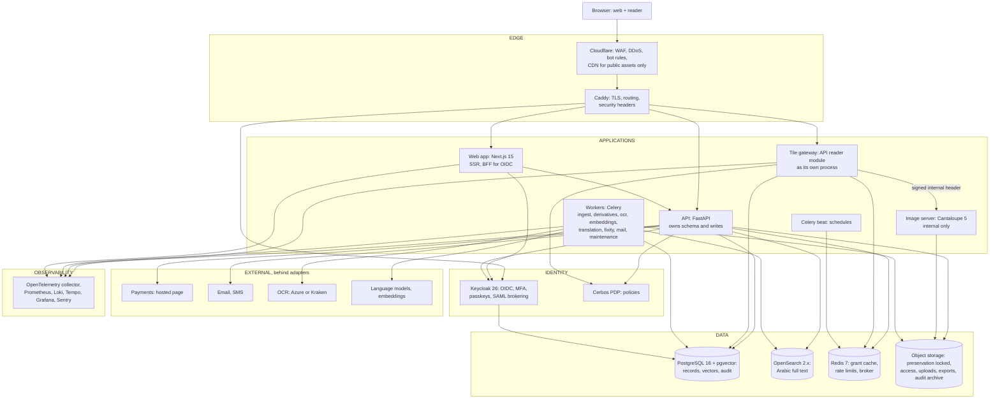
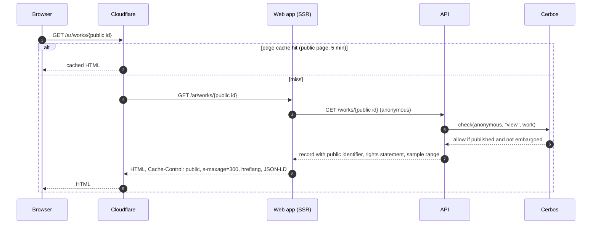
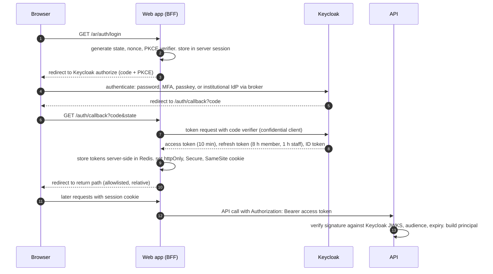
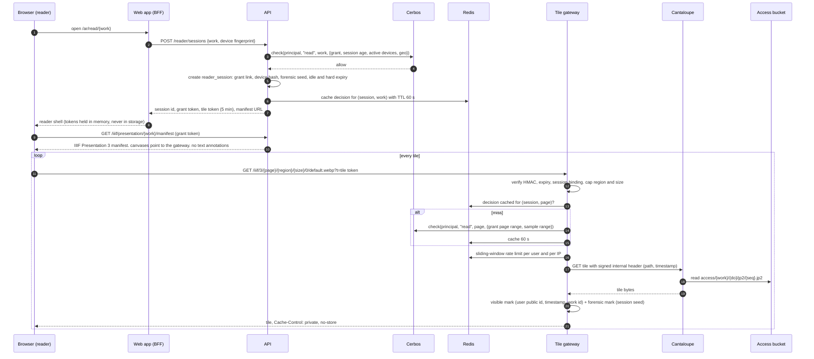
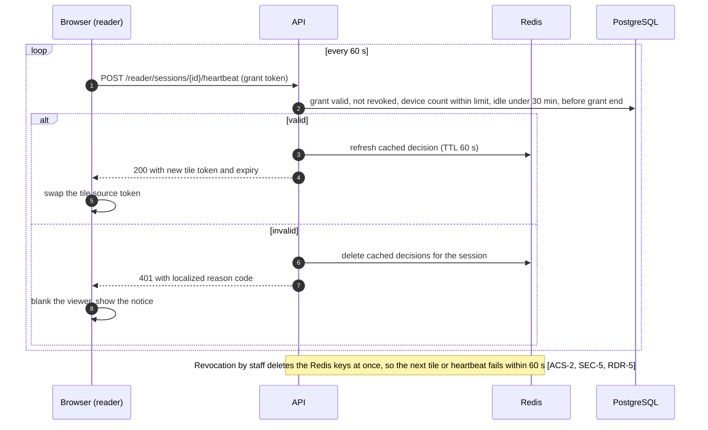
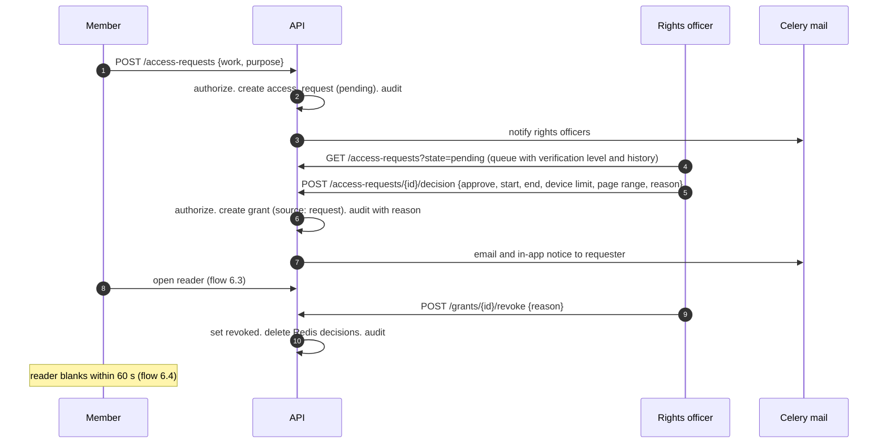
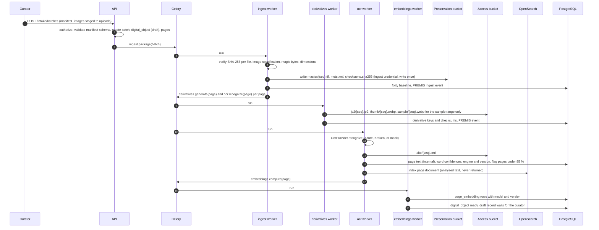
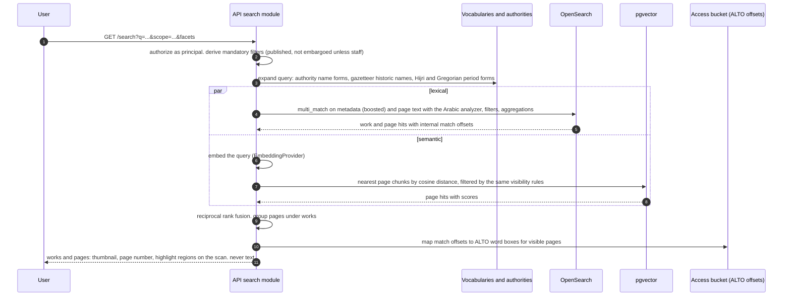
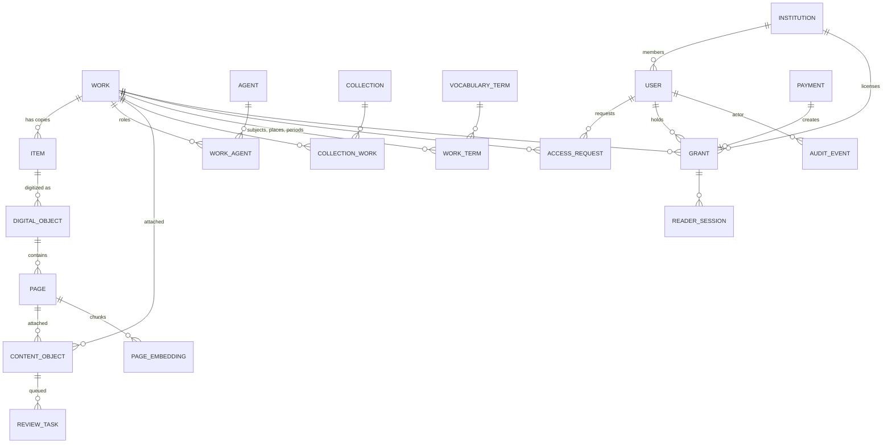

# Architecture

Status: derived from `SPEC.md` (as of 2026-10-04) in the first session and aligned with the accepted `docs/decisions/ADR-0001-stack.md`. Passages that depend on a decision cite it as `ADR-0001 Dn`. Requirement identifiers from `SPEC.md` appear in square brackets so every design element traces back to a requirement.

## 1. Purpose and scope

This document describes the core layer of the Jordanian Digital Heritage Platform: the secure digital library. It covers the system at context, container and module level, the runtime flows that matter for security and correctness, the data and storage architecture, the authorization and content-protection design, search and the job pipeline, the web application, and the deployment topology.

Companion documents: `docs/THREAT_MODEL.md` analyses threats and controls; `docs/DESIGN.md` records the visual direction (Phase 0); `docs/COMPLIANCE_MATRIX.md` maps controls to ISO 27001 Annex A (Phase 4); `docs/decisions/` holds the ADRs.

Later layers (the immersive AI reader, the scene-generation pipeline, educational products) are out of scope. They integrate through the API only. The only provision made for them here is the `content_object` shape and the reserved `provenance_type` values.

## 2. Architectural principles

These principles restate the rules in `CLAUDE.md` and `SPEC.md` at design level. When two designs both satisfy a requirement, the one that better honours the principle wins.

1. **The scan is the interface.** Protected pages reach a browser only as watermarked tiles through the authorizing image path. No original, no PDF, no EPUB, no full-resolution image, no reassemblable page set is ever delivered. [RDR-1, RDR-2, SEC-10, SEC-11]
2. **OCR text is internal.** It feeds search, indexing, translation and alignment. It is never rendered, selected, copied, or returned by a public response in any shape. Search and in-book search return page identifiers and scan coordinates, not text. [CAT-4, RDR-3, SRCH-4]
3. **Every request is authorized by the policy engine.** Every route in the public API resolves principal, action, resource and context and asks Cerbos. A test walks the router and fails on any route without the check. Anonymous and public routes are authorized as the `anonymous` principal; there are no exemptions. [SEC-6]
4. **Nothing AI-generated is public until a Reviewer approves it in the portal.** Objects with `origin = ai` are created at `pending`. The only transition to `approved` is the review portal action, enforced in the service layer and again by the database. [REV-1, SRC-2, ADM-8]
5. **Source and interpretation never blend.** Every content object carries `provenance_type` and `origin`; the reader renders each type in its own labelled frame; citations always point at the scan. [SRC-1, SRC-3]
6. **One codebase writes the database.** The API package owns the schema, the migrations and every write path. Workers reuse that package under a restricted database role (`ADR-0001 D17`). The web app, the image server and Keycloak never write to the platform schema.
7. **External services sit behind adapters.** OCR, language models, embeddings, payments, email and SMS are interfaces with at least one real and one mock implementation, selected by configuration. Production refuses providers that are not on the allowlist. [TRN-6, ACS-3]
8. **Rich model inside, standards outside.** The internal model is richer than any single standard and maps out to Dublin Core, MODS, MARC 21, METS, PREMIS, ALTO and IIIF. Public identifiers are persistent and opaque; internal identifiers never leave the server. [Content and metadata standards, INT-7]
9. **Arabic first, both languages complete.** Every string is externalized, only logical CSS properties are used, every content container carries `dir`, the interface direction follows the interface language and the content direction follows the content language. [INT-1 to INT-7]
10. **Infrastructure is code and the build is portable.** The same images run on a laptop, in a cloud region and in the institution's data centre. The only cloud dependency is S3-compatible object storage. Configuration is validated at startup and a service refuses to boot with a missing or insecure setting. [Hosting]

## 3. System context



The roles, their verification levels and what each can do are defined in the "Users, roles, and access tiers" section of `SPEC.md` and are not repeated here. Two facts about the context shape the whole design:

- The browser is an untrusted execution environment. Everything the browser receives is assumed to be captured. Protection therefore means never sending anything worth stealing, and marking what is sent so a leak is traceable.
- Every external system is a replaceable provider behind an adapter, including the identity providers, which Keycloak brokers.

## 4. Container view



Requests enter through the edge. The API makes every access decision with Keycloak-issued identity and Cerbos policies. The tile gateway serves a tile only after that decision, cached for 60 seconds in Redis, and only after watermarking. Workers call OCR and the AI models and write derivatives, vectors and search documents. Cantaloupe reads the access bucket and is reachable only from the tile gateway.

| Container | Technology | Responsibility | Trust zone | Repository path |
| --- | --- | --- | --- | --- |
| Cloudflare | Managed edge | WAF, DDoS, bot management, DNS, CDN for public assets. Protected paths (`/iiif`, `/api`, reader, account, admin) bypass the cache. AI crawlers allowed on catalog paths, blocked on reader, account and admin paths [SEO-5] | Edge | `infra/` (documented rules) |
| Caddy | Caddy 2 | Automatic TLS [SEC-22], reverse proxy to web, API, tile gateway and Keycloak, security headers [SEC-16], request IDs | Edge | `infra/compose`, `infra/k8s` |
| Web app | Next.js 15, TypeScript, Tailwind, next-intl, OpenSeadragon | Server-rendered public pages, reader shell, account, staff portals. OIDC relying party (backend-for-frontend). Calls the API through the typed client only. Never touches the database or object storage | Application | `apps/web` |
| API | FastAPI, Python 3.12, SQLAlchemy 2, Alembic, Pydantic v2 | All business logic, every policy check, the only owner of the schema and migrations, audit writer, public metadata API, IIIF Presentation manifests | Application | `apps/api` |
| Tile gateway | The API's `reader` module run as a separate process from the same image | Validates tile tokens, grants, page ranges and rate limits; fetches tiles from Cantaloupe; applies visible and forensic watermarks; never caches tiles | Application | `apps/api` (`reader/tiles`) |
| Workers | Celery 5, Redis broker | Ingest, derivatives, OCR, embeddings, translation, fixity, mail, maintenance. Import the API package as a library (`ADR-0001 D17`) | Application | `apps/worker` |
| Celery beat | Celery | Scheduled jobs: fixity, identity-document deletion, grant expiry, audit shipping, nightly bulk export | Application | `apps/worker` |
| Cantaloupe | Cantaloupe 5 | IIIF Image API 3.0 from JPEG 2000 and pyramidal TIFF in the access bucket. Delegate verifies the gateway's signed header and maps identifiers to bucket keys. No public exposure | Application, internal only | `infra/cantaloupe` |
| Keycloak | Keycloak 26 | Authentication, MFA, passkeys, account lockout, breached-password check, session management, SAML and OIDC brokering for institutions, group-to-role mapping | Identity | `infra/keycloak` |
| Cerbos | Cerbos PDP | Attribute-based authorization decisions from versioned YAML policies; policies baked into the image, never mounted writable | Identity | `policies/` |
| PostgreSQL | 16 with pgvector | Records, page text (internal), vectors, grants, audit log; row-level security; Keycloak's own schema in a separate database | Data | `apps/api/alembic` |
| OpenSearch | 2.x with ICU plugin | Lexical search over metadata and OCR text with the Arabic analyzer; facets; rebuilt from PostgreSQL and ALTO, not backed up | Data | `infra/opensearch` |
| Redis | 7 | Grant decision cache (60 s), rate-limit windows, reader heartbeat, BFF session store, Celery broker and result backend | Data | `infra/compose` |
| Object storage | S3-compatible (MinIO locally) | Buckets `preservation`, `access`, `uploads`, `exports`, `audit-archive` with the policies in section 9.7 | Data | `infra/compose`, `infra/k8s` |
| Observability | OpenTelemetry collector, Prometheus, Loki, Tempo, Grafana, Sentry | Traces from tile to grant check, metrics, logs with redaction, alerts [SEC-25, SEC-26] | Operations | `infra/compose`, `infra/k8s` |

## 5. API internal structure

The API is a modular monolith. One deployable, one database, strict module boundaries.

```text
apps/api/
  pyproject.toml                jdhp-api distribution (ADR-0001 D1)
  alembic/                      forward-only migrations with documented reverse scripts
  src/jdhp_api/
    main.py                     public ASGI app: routers, middleware, lifespan
    internal_app.py             internal ASGI app on a separate port: health, readiness, metrics
    tiles_app.py                tile gateway ASGI app (reader module), run as its own process
    core/
      config.py                 pydantic-settings; validated at startup; refuses insecure values
      db.py                     engine, sessions, per-transaction RLS context (SET LOCAL app.*)
      ids.py                    UUIDv7 primary keys; public identifier minter (ARK, ADR-0001 D10)
      auth.py                   Keycloak token verification (JWKS), principal construction
      authz.py                  Cerbos client, Authorize dependency, resource loaders, fail-closed
      audit.py                  hash-chained audit writer, same transaction as the change
      ratelimit.py              Redis sliding windows
      i18n.py                   localized API messages, ar default, en
      storage.py                S3 clients per bucket and credential
      observability.py          OpenTelemetry, structured logging with redaction
      errors.py                 RFC 9457 problem details with codes, no internals
    modules/
      catalog/                  work, agent, item, collection, vocabulary_term, landing pages, public metadata shapes
      identity/                 user, institution, sessions, researcher verification, data export and deletion
      access/                   access_request, grant, institutional license, payment via PaymentGateway adapter
      reader/                   reader_session, grant and tile tokens, manifests, tile authorization, watermark, print
      content/                  content_object, provenance labels, glossary_term
      review/                   review_task, portal actions, the only path to approved
      ingest/                   intake batches, digital_object, page, derivatives, fixity, PREMIS
      search/                   query understanding, OpenSearch and pgvector retrieval, fusion, highlight regions
      audit/                    audit viewer, signed exports
      admin/                    dashboard, rights management screen, four-eyes approvals, break-glass
      public/                   open JSON API, OAI-PMH, sitemaps, robots.txt and llms.txt data
    adapters/                   PaymentGateway, EmailProvider, SmsProvider interfaces and implementations
  tests/
    conftest.py                 database per test, factories, seed book fixtures, mock providers
    test_route_coverage.py      SEC-6 gate
    test_ai_gating.py           REV-1 gate
    modules/...                 one test module per module
```

Each module exposes `models.py`, `schemas.py`, `service.py` and `router.py`. Rules, enforced by import-linter in CI:

- Routers call services. Routers never import models directly and never touch a session outside a service.
- A module imports another module only through its `service` interface, never its models.
- Every write goes through a service function, which is the place where invariants, audit events and versioning live. Celery tasks in `apps/worker` call the same service functions (`ADR-0001 D17`).
- Every router handler declares its `Authorize` dependency. The route-coverage test fails on any handler that does not [SEC-6].
- `core.config` is the only reader of the environment.

## 6. Runtime flows

### 6.1 Public page render



Public responses are server-rendered and edge-cached for 5 minutes; anything personalized or protected carries `Cache-Control: private, no-store` [PRF-4]. Embargoed works return the same not-found response as a missing identifier for every principal below staff, from the API and from the web app alike [CAT-5].

### 6.2 Sign-in



The web server is the OIDC relying party. Tokens live in the server-side session store, never in the browser [SEC-1, SEC-2]. Refresh rotation and reuse detection are Keycloak settings in the realm export. The API only ever sees signed access tokens. The library for the relying party is decided in Phase 0 (ADR).

### 6.3 Opening the reader and fetching tiles

This is the flow that carries the platform's central promise.



Design points: [RDR-1, RDR-2, SEC-10, SEC-11, SEC-12]

- The grant token is bound to user, work, device fingerprint and reader session [SEC-2]. The tile token is a 5-minute HMAC bound to the reader session and carried in the tile URL [SEC-10]. Both are refreshed by the heartbeat, so a captured tile URL dies within 5 minutes and a captured grant token dies with the session.
- The gateway caps the pixel area of any single response and refuses `max` sizes for protected works, so no request returns a page at a resolution worth keeping. `info.json` advertises only the permitted sizes.
- Cantaloupe accepts only requests that carry a valid short-lived signed header from the gateway, so a foothold inside the network still cannot fetch unwatermarked tiles.
- Tiles are never cached by the gateway, by Caddy or by Cloudflare. Cantaloupe's derivative cache is disabled for protected sources.
- Sample pages and open-access works go through the same gateway with an anonymous token and the platform mark [SEC-14]. Because that mark is static, those tiles may be edge-cached for 5 minutes.

### 6.4 Heartbeat, expiry and revocation



Reader analytics (page views, dwell time) ride on the heartbeat payload and land in the audit log, not in any advertising system [RDR-6].

### 6.5 Print

The reader requests a print of a page range. The API checks the grant's print quota and the work's access class policy, enqueues `derivatives.render_print_pdf`, and the worker renders a 150 ppi PDF with the visible and forensic marks, writes it to `exports/` (24-hour lifecycle) and records an audit event with the page numbers. The API returns a single-use signed URL valid 15 minutes; the object is deleted after the download [RDR-4, SEC-11, SEC-15].

### 6.6 Access request to grant to revocation



Changing a grant's end date, an access class or pricing is a four-eyes operation: the change is recorded as a proposal and takes effect only when a second staff member with the right role approves it [SEC-9, ADM-3].

### 6.7 Paid access

The member chooses a duration (24 hours, 7 days, 30 days) and is redirected to the gateway's hosted page. The gateway calls back; the API verifies the signature, confirms the transaction server-to-server, checks amount and currency, and creates a grant with the paid duration, idempotently on the transaction reference. The platform stores only the gateway's reference [ACS-3, SEC-30]. Phase 2, `ADR-0001 D4`, `ADR-0001 D11`.

### 6.8 Digitization intake and pipeline



[ADM-1, Image and file specifications, Preservation rules, SRCH-6]

### 6.9 AI translation to review to publication

Phase 3. The translation job runs per work: the worker assembles the work metadata, the glossary, the chapter structure, the previous and next pages and the already approved translations, calls the `LanguageModelProvider`, and stores a page-aligned, segment-aligned `content_object` with `origin = ai`, `review_status = pending`, model, version, prompt template version, glossary version and self-assessment score. A `review_task` is created in the same transaction. The Reviewer works the queue in the portal, edits in place (stored as a diff), and approves or rejects with a reason; each action writes an audit event with the reviewer identity. Approval is the only code path that sets `approved`, and the search index and the reader panel show the object only after it. Rejection re-enqueues the job with the reviewer's note in context up to the configured limit, then escalates to a human translator [TRN-1 to TRN-6, REV-1 to REV-4, ADM-8].

### 6.10 Search



Protected pages outside the sample range return the hit position (page number and region count) without the scan until the user holds a grant [SRCH-1 to SRCH-5, CAT-4, CAT-5].

### 6.11 Audit event path

Every protected page read, authorization decision, admin action, login and grant change calls `audit.write()` inside the transaction of the change it records. The writer takes a short advisory lock on the chain head, computes `hash = SHA-256(prev_hash || canonical JSON of the event)`, and inserts. The audit tables grant no `UPDATE` or `DELETE` to any runtime role. A daily maintenance job ships the closed day as JSON Lines plus the head hash to the `audit-archive` bucket under object lock, and a verification job recomputes the chain [SEC-25, SEC-27, ADM-5].

## 7. Authorization architecture

### 7.1 Decision model

A decision reads: can this principal perform this action on this resource under these conditions.

| Element | Contents |
| --- | --- |
| Principal | `id` (Keycloak subject), `roles`, `verification_level`, `institution_id`, `mfa_level`, `session_age_seconds`, `active_devices`, `ip_country`, `is_staff`. Anonymous visitors are the `anonymous` principal with no roles |
| Resource kinds | `work`, `page`, `content_object`, `collection`, `vocabulary_term`, `agent`, `user`, `institution`, `access_request`, `grant`, `payment`, `review_task`, `intake_batch`, `digital_object`, `audit_event`, `glossary_term`, `system` |
| Resource attributes | For a work: `access_class`, `publish_state`, `pricing`, `owner_institution`. For a page: `work`, `seq`, `in_sample_range`. For a content object: `origin`, `review_status`, `provenance_type`. For a grant: `user`, `work`, `valid`, `page_range`, `device_limit`, `active_devices`, `revoked`. For a request or approval: `proposed_by`, `second_approver` |
| Actions | `view`, `read`, `print`, `cite`, `bookmark`, `request_access`, `create`, `edit`, `publish`, `withdraw`, `set_access_class`, `set_pricing`, `approve`, `reject`, `assign`, `revoke`, `export`, `break_glass`, `manage_users`, `view_identity_document` |
| Conditions | Grant validity and page range, session age, active device count against the limit, geographic rules set by the rights officer, four-eyes state, active break-glass window |

### 7.2 Policy layout

```text
policies/
  .cerbos.yaml                PDP configuration: disk storage, policies baked into the image
  _schemas/                   JSON schemas for principal and resource attributes (Cerbos schema enforcement)
  derived_roles/              grant_holder, sample_viewer, institution_member, same_institution_admin, second_approver
  resources/                  one policy per resource kind: work.yaml, page.yaml, content_object.yaml, ...
  tests/                      Cerbos test suites: every role x access class x action, including every denial
```

Policy rules that implement the spec's tables, in plain words:

- `work.read`: allowed for anyone when `access_class = open`; for members when `registered`; for a principal holding a valid grant when `paid` or `restricted`; for staff when `embargoed`. Always denied when `publish_state` is not `published`, except to staff.
- `page.read`: `work.read` plus the grant's page range, or the page is inside the sample range for the class (all pages for open, first 10 for registered and paid, first 3 for restricted, cover only for embargoed).
- `content_object.view`: denied for every non-staff principal when `origin = ai` and `review_status != approved` [REV-1].
- `work.set_access_class`, `work.set_pricing`, `grant.extend`: allowed only as a proposal; the matching `approve` action requires a different principal with the right role [SEC-9].
- `system.break_glass`: platform admins only, requires an approved request by a second admin, expires after one hour [SEC-8].

### 7.3 Enforcement in the API

`Authorize(action, kind, loader)` is a FastAPI dependency. It loads the resource through the module's loader (by public identifier, never by internal id), builds the principal from the verified token or `anonymous`, calls Cerbos, writes the decision to the audit log, and raises a localized 403 (or 404 where existence must not leak) on deny. A Cerbos error is a deny and an alert [SEC-26]. The dependency attaches metadata to the route; `tests/test_route_coverage.py` walks `app.routes` and fails on any route without it, with no allowlist. Health, readiness and metrics live on the internal ASGI app on a separate port and are not routable from the edge [SEC-6].

### 7.4 Row-level security

The API connects as `jdhp_app`, the worker as `jdhp_worker`, migrations as `jdhp_migrate`. None has `BYPASSRLS`. Every transaction starts with `SET LOCAL app.user_id`, `app.roles` and `app.institution_id`. Policies on institution-scoped tables (users, licenses, usage, grants by license) restrict rows to the caller's institution; policies on staff tables restrict them to the role's scope. Tests prove that a curator cannot read identity documents and that an institution admin cannot read another institution's users [SEC-7].

## 8. Content protection architecture

### 8.1 Tokens

| Token | Form | Bound to | Lifetime | Carried in |
| --- | --- | --- | --- | --- |
| Access token | Keycloak JWT | user, client | 10 min | BFF to API header |
| Refresh token | Keycloak, rotated, reuse detected | user, client | 8 h members, 1 h staff | BFF session store only |
| Grant token | Signed compact token issued by the API (format decided in Phase 0 ADR) | user, work, grant, device fingerprint hash, reader session | 10 min, refreshed by heartbeat | Reader memory, `Authorization` on reader endpoints |
| Tile token | HMAC-SHA256 over session id, work, expiry, key id | reader session | 5 min, refreshed by heartbeat | `t` query parameter on tile URLs |
| Internal image header | HMAC over path and timestamp | gateway to Cantaloupe | 30 s | `X-Jdhp-Image-Auth` |
| Download URL | Signed, single use | export or print object, user | 15 min | URL |

Keys are per environment, rotated yearly or on suspected exposure [SEC-19], identified by `kid` so rotation is zero-downtime.

### 8.2 Watermarks

- Visible: rendered by pyvips in the gateway on every protected tile: user public identifier (never the email), ISO timestamp, work public identifier, repeated at low opacity along a diagonal so that any crop still carries one instance. Public samples and open works carry the platform mark [RDR-2, SEC-11, SEC-14].
- Forensic: a spread-spectrum mark seeded from a per-session key derived with HKDF from an environment master key and the reader session id. The session key is stored encrypted on the `reader_session` row so a leaked page can be traced to user, grant and time [SEC-11]. The library is chosen in Phase 1 (ADR) and the detector ships as a staff tool in `apps/worker`.
- Print PDFs carry both marks at 150 ppi [RDR-4].

### 8.3 Rate limiting and anomaly response

Redis sliding windows per user and per IP on tile requests, sized to reading speed: about 3 pages per second burst (pages times tiles per page) and 600 tiles per minute sustained, both configuration values. Exceeding a limit suspends the reader session, flags the account, writes a high-severity audit event and raises an alert [SEC-12, SEC-26].

### 8.4 What the browser never receives

No original, no derivative larger than a capped tile, no OCR text, no ALTO, no text annotations in manifests, no manifest for a protected work without a grant token, no unexpired signed URL that can be reused. The reader's right-click and selection blocking and the strict CSP are deterrents only [SEC-13]; the control is the list above.

## 9. Data architecture

### 9.1 Entities



The entity purposes and key fields are the "Core entities" and "Page-level metadata" tables in `SPEC.md`. Additions implied by requirements:

| Addition | Purpose | Requirement |
| --- | --- | --- |
| `reader_session` | One open reader: grant link, device fingerprint hash, forensic session key (encrypted), idle and hard expiry, last heartbeat | SEC-2, SEC-11, RDR-5 |
| `approval` | Four-eyes proposals: kind, payload, `proposed_by`, `approved_by`, state; database check `approved_by <> proposed_by` | SEC-9, ADM-3 |
| `break_glass_request` | Requester, approver, scope, expiry, state | SEC-8 |
| `record_change` | Field-level history at work and page level: entity, field, old, new, actor, time, reason | ADM-2 |
| `premis_event` | Preservation events per digital object and file | Preservation rules |
| `institution_license` | Access classes covered and seat limit per institution | ACS-4 |
| `verification_case` | Researcher verification: documents (bucket keys), decision, reason, decided at, deletion due date | ACC-3 |
| `print_job` | Grant, pages, rendered at, downloaded at | RDR-4 |

### 9.2 Invariants enforced in code and in the database

| Invariant | Service layer | Database |
| --- | --- | --- |
| An `ai` content object is created at `pending` | Constructor sets it; schemas do not accept `review_status` | `CHECK (origin <> 'ai' OR review_status IS NOT NULL)` and default `pending` |
| Only the review portal action sets `approved` | `review.service.approve()` is the only function that writes it | Trigger rejects an update to `approved` unless the transaction set `app.review_action = 'approve'` and `app.roles` contains `reviewer` |
| Audit events are append-only | No service updates or deletes | No `UPDATE`/`DELETE` privilege; trigger raises on both |
| Four-eyes approvals need two people | State machine | `CHECK (approved_by <> proposed_by)` |
| Internal ids never leave the server | Response schemas carry `public_id` only | Test asserts no UUID-shaped value in any public response |
| Grants are revocable and bounded | Revocation deletes cache keys | `CHECK (ends_at > starts_at)` |
| Soft delete only where allowed | `deleted_at` on permitted tables only | No `deleted_at` column on audit, grant, payment |

### 9.3 Identifiers

Primary keys are UUIDv7. Public identifiers are ARKs (`ADR-0001 D10`): `ark:/{NAAN}/{name}` for works and collections, `ark:/{NAAN}/{name}/p{seq}` for pages. Names are opaque NOID-style strings with a check character, minted by `core.ids` from a sequence with a configurable shoulder per type. URLs use the name as the slug so links are stable across languages [INT-7], and `/ark:/{naan}/{name}` resolves to the canonical localized page. The citation on every page states the ARK of the scan, never of an interpretation [CAT-1, SRC-3]. Agents additionally carry VIAF or Library of Congress identifiers where they exist; places link to GeoNames where possible.

### 9.4 Dates, languages and scripts

Dates are stored as EDTF strings with derived earliest and latest Gregorian bounds for sorting and faceting, and a Hijri form alongside where the source gives one [INT-4]. Every text object states language (ISO 639-3) and script (ISO 15924), including mixed Arabic and Ottoman Turkish material. Transliteration follows ALA-LC and is stored as its own field for Latin-script search [INT-6].

### 9.5 Versioning

Every change to a work or page field by a curator writes a `record_change` row in the same transaction, at document level and at page level, so the editor can show field-level history and bulk edits can be reverted [ADM-2]. Published records keep their current state in the entity row; history lives in `record_change`.

### 9.6 Search index and vectors

OpenSearch holds two indices per version: `works-v{n}` for metadata and `pages-v{n}` for OCR text. Page text is indexed but excluded from `_source` and not stored, so no API call can retrieve it. Match offsets are mapped to ALTO word coordinates through an offsets file written next to the ALTO at OCR time. The index is rebuilt from PostgreSQL and the access bucket and is not backed up. `page_embedding` rows hold chunk index, vector, model and version; a model change triggers a tracked re-embedding job [SRCH-6]. Section 10 details the analyzer and ranking.

### 9.7 Storage layout and credentials

```text
preservation/            object lock (compliance mode), versioning on, API has no write credential
  {work_id}/{digital_object_id}/
    mets.xml
    master/{page_seq}.tif
    checksums.sha256
access/                  versioned, derivatives only, regenerable
  {work_id}/{digital_object_id}/
    jp2/{page_seq}.jp2
    alto/{page_seq}.xml
    alto/{page_seq}.offsets.json   match-offset to word-box map for highlights
    thumb/{page_seq}.webp
    sample/{page_seq}.webp         only pages in the public sample range
uploads/                 30-day lifecycle rule, dedicated key, identity documents only
exports/                 24-hour lifecycle rule, audit exports and print PDFs
audit-archive/           object lock, 7-year retention, daily audit shipments (SEC-25)
```

| Bucket | Writer | Readers | Protection |
| --- | --- | --- | --- |
| `preservation` | Ingest worker, through the dedicated ingest credential, write once | Fixity worker (read), restore tooling | Object lock, versioning, server-side encryption, replication to a second site, quarterly offline copy |
| `access` | Derivatives and OCR workers | Cantaloupe (read-only credential), API (ALTO offsets, manifests) | Versioning, encryption, daily replication |
| `uploads` | API (identity documents, intake staging) | Rights officers through the API only; ingest worker for staged images | Dedicated key, 30-day lifecycle, encryption |
| `exports` | Workers | Single-use signed URLs | 24-hour lifecycle, encryption |
| `audit-archive` | Audit shipping job | Auditors through signed export | Object lock, 7 years |

Bucket names and prefixes are configuration. The `{work_id}` and `{digital_object_id}` in keys are internal UUIDs, which is acceptable because bucket keys are never exposed.

### 9.8 Preservation model

The OAIS mapping: the submission information package is the intake batch (manifest plus images), the archival information package is the METS package in `preservation/` plus the PREMIS events in PostgreSQL, and the dissemination information package is the access derivatives served through IIIF. PREMIS events are written for ingest, fixity check, derivative generation, access class change and withdrawal. A fixity mismatch opens an incident and sets the digital object to `frozen`, which the `work.view` policy treats as not published. The METS package plus the PostgreSQL export is the restore unit tested quarterly.

### 9.9 Redis key design

| Prefix | Content | TTL |
| --- | --- | --- |
| `jdhp:grant:{session}:{page}` | Cached allow decision | 60 s |
| `jdhp:rl:tiles:user:{id}`, `jdhp:rl:tiles:ip:{ip}` | Sliding window counters | window length |
| `jdhp:hb:{session}` | Last heartbeat | 30 min |
| `jdhp:sess:{id}` | BFF session (tokens, encrypted) | refresh lifetime |
| Celery broker and results | Separate logical database | task dependent |

## 10. Search architecture

### 10.1 Arabic analyzer

Defined in `infra/opensearch/` as an index template, versioned:

1. Character filters: remove tashkeel (U+064B to U+0652, U+0670), remove tatweel (U+0640), normalize alef variants and hamza carriers to bare alef, teh marbuta to heh, alef maksura to yeh, as the content standards require.
2. Tokenizer: `icu_tokenizer`.
3. Token filters: `lowercase`, `icu_normalizer` (NFKC casefold), `arabic_normalization`, `arabic_stem` (light stemming), Arabic and English stop words, `icu_folding` for Latin diacritics.
4. Sub-fields: `.exact` (normalized but unstemmed) for phrase matches, `.translit` for ALA-LC forms, `.en` with the English analyzer.

### 10.2 Ranking and visibility

Metadata fields are boosted above page text (title 5, agents and subjects 3, description 2, text 1). Mandatory filters for every non-staff principal: `publish_state = published`, `access_class != embargoed`, `digital_object.state != frozen`. Facets are aggregations computed after those filters, so counts never reveal embargoed titles [CAT-5]. Lexical and semantic hits are fused by reciprocal rank fusion with k = 60, grouped into works with their best pages. Query understanding expands names, places and periods from authorities, the gazetteer and the vocabularies [SRCH-2], and cross-lingual matching comes from the multilingual embeddings and approved translations [SRCH-3]. Scope narrows to one work, one collection or the catalog [SRCH-5].

### 10.3 Highlights without text

The highlighter runs server-side with term vectors. The API reads matched offsets, maps them through `alto/{seq}.offsets.json` to word boxes, and returns regions in page pixel coordinates. Fragments and snippets are discarded before the response is built. A test asserts that no search response contains any run of page text [CAT-4, RDR-3].

### 10.4 Performance

Targets are PRF-3 (p95 under 500 ms at 100,000 pages) and PRF-2. Query embeddings are cached briefly in Redis, result windows are capped, expensive query forms (leading wildcards, regular expressions, deep pagination) are not exposed, and the index uses one shard per 50,000 pages with one replica.

## 11. Background processing

| Queue | Tasks | Notes |
| --- | --- | --- |
| `ingest` | package, verify checksums and specifications, write masters, METS | The only pool holding the preservation write credential |
| `derivatives` | JPEG 2000, thumbnails, samples, print PDFs | pyvips, CPU bound, isolated resource limits |
| `ocr` | recognize page, write ALTO and offsets, index | `OcrProvider` adapter, provider rate limits, retries with backoff |
| `embeddings` | embed page chunks, re-embed on model change | Records model and version per vector |
| `translation` | translate work, retry with reviewer note | Phase 3, `LanguageModelProvider` adapter |
| `fixity` | quarterly master and derivative verification | Incident and freeze on mismatch |
| `mail` | email and SMS through adapters | Templates in both languages |
| `maintenance` | identity-document deletion, grant expiry sweep, audit shipping, nightly bulk export, session cleanup | Scheduled by beat |

Reliability rules: JSON serialization only, `acks_late`, idempotency keys on object ids, bounded retries with jitter, dead-letter queue, per-task time limits, OpenTelemetry spans linked to the originating request.

| Schedule | Job |
| --- | --- |
| Every minute | Grant expiry sweep, reader session idle cleanup |
| Daily | Audit shipping to `audit-archive`, identity documents past their deletion date, nightly open-metadata bulk export [SEO-6] |
| Quarterly | Fixity verification of masters and derivatives |
| Monthly | Dependency update window reminder [SEC-18] |

## 12. Adapters

| Interface | Package | Implementations | Selection |
| --- | --- | --- | --- |
| `OcrProvider.recognize(image, language hints) -> OcrResult(alto, text, word confidences, engine, version)` | `packages/ai-adapters` | `AzureDocumentIntelligenceOcr` (`ADR-0001 D5`), `KrakenOcr`, `MockOcr` fed by the seed book | `OCR_PROVIDER` |
| `LanguageModelProvider.complete(prompt, context) -> Completion(text, model, version, usage)` | `packages/ai-adapters` | `ClaudeLanguageModel` (`ADR-0001 D6`), second provider, `MockLanguageModel` | `LLM_PROVIDER`, allowlist of no-training providers |
| `EmbeddingProvider.embed(texts) -> Embeddings(vectors, model, version, dimensions)` | `packages/ai-adapters` | Chosen in Phase 3 (`ADR-0001 D7`), `MockEmbeddings` | `EMBEDDING_PROVIDER` |
| `PaymentGateway.create_checkout(...)`, `verify_callback(...)`, `confirm(...)` | `apps/api/adapters` | `HyperPayGateway` (`ADR-0001 D4`), `MockGateway` | `PAYMENT_PROVIDER` |
| `EmailProvider.send(...)` | `apps/api/adapters` | `SmtpEmail`, `MockEmail` (Mailpit locally) | `EMAIL_PROVIDER` |
| `SmsProvider.send_otp(...)` | `apps/api/adapters` | Jordanian gateway, `MockSms` | `SMS_PROVIDER` |

Every provider implementation declares `trains_on_inputs: bool` and `data_region`; configuration validation refuses a `trains_on_inputs` provider for page text in any environment but local [TRN-6].

## 13. Web application architecture

```text
apps/web/
  app/[locale]/(public)/            home, catalog and search, works/[name], collections, subjects by place, period, theme and material
  app/[locale]/(account)/           profile, sessions and devices, requests, bookmarks and citations, verification, data export
  app/[locale]/(reader)/read/[name] the reader
  app/[locale]/(staff)/             admin, review portal, rights, intake, audit viewer
  app/api/auth/*                    BFF: login, callback, logout, session refresh
  app/ark:/[naan]/[...name]         persistent identifier resolver
  components/                       reader (OpenSeadragon), provenance frames and labels, facets, forms, tables
  lib/api/                          typed client generated from packages/schemas
  messages/ar.json, en.json         ICU messages [INT-1]
  middleware.ts                     locale routing, CSP nonce, security headers, cache rules
```

- Internationalization: `ar` is the default locale, `en` the second. Routes are `/ar/...` and `/en/...` with `hreflang` alternates [SEO-2]. `<html dir>` follows the interface language; every content container carries `dir` and `lang` from the record's language, so an Arabic book in the English interface still reads right to left [INT-2]. Numerals follow the user preference; heritage dates show Gregorian with Hijri [INT-4]. Fonts are self-hosted, subset per script and preloaded [PRF-5, INT-3].
- Design tokens: `packages/design-tokens` holds the tokens as JSON (OKLCH palette, 7-step fluid type scale, 8-point spacing, 2 px radius on controls, no elevation) and builds CSS variables and the Tailwind preset. Light and dark themes derive from the same hues. Choices are recorded in `docs/DESIGN.md` (`ADR-0001 D14`).
- Reader: OpenSeadragon with the IIIF tile source pointing at the gateway with the tile token. A heartbeat every 60 seconds refreshes tokens and blanks the viewer on failure. Side panel for table of contents, in-book search (regions drawn from ALTO coordinates), bookmarks, citation copy and labelled secondary content. No text layer exists in the DOM at any time. Fully keyboard operable [RDR-3, RDR-5, ACX-2].
- Authentication: backend-for-frontend as in flow 6.2. The browser holds one httpOnly cookie.
- Security headers: CSP with per-request nonces and no inline scripts, HSTS with preload, `X-Content-Type-Options`, `Referrer-Policy: strict-origin-when-cross-origin`, COOP and COEP where the viewer allows, `frame-ancestors 'none'` [SEC-16]. Protected and personalized responses are `private, no-store` [PRF-4].
- SEO and open data: server-rendered metadata, Open Graph, Schema.org `Book`, `CollectionPage` and `Dataset` JSON-LD, sitemap index by type excluding protected pages, `robots.txt` allowing named AI crawlers on catalog paths and disallowing reader, account and admin paths, `llms.txt`, a machine-readable citation block on every public page [SEO-1 to SEO-7].
- Accessibility: WCAG 2.2 AA, axe in Playwright, visible focus, errors in text beside fields, reduced motion honoured. The absence of a text alternative for scanned pages is a documented limitation [ACX-1 to ACX-5].
- Typed client: generated from the API's OpenAPI document into `packages/schemas` on every API change; the web app never hand-writes a request shape.

## 14. Cross-cutting concerns

- Configuration: `pydantic-settings` reads environment variables and secret files once, validates types and ranges, and refuses to boot on an empty or default secret, `DEBUG` outside local, a non-HTTPS issuer, a provider missing from the allowlist, or a missing bucket. `.env.example` documents every variable with no real values [SEC-19].
- Secrets: Docker secrets or Kubernetes secrets backed by SOPS or Vault, mounted as files. Nothing in git [SEC-19].
- Observability: OpenTelemetry in the API, gateway, workers and web app with trace propagation to Cantaloupe through headers; metrics for tiles per second, grant cache hit rate, policy latency, queue depth, rate-limit hits, fixity status; structured JSON logs with a redaction filter for tokens, passwords and identity data [SEC-27]; Sentry for errors; alerts for failed login spikes, rate-limit hits, break-glass use, fixity failures and policy engine errors [SEC-26].
- Errors: RFC 9457 problem details with a stable `code`, a localized `title` and `detail` chosen by `Accept-Language` (Arabic default), and no internal identifiers or stack traces.
- Time: UTC in storage, EDTF for heritage dates with Hijri alongside, locale-aware rendering in the web app.
- Testing: the levels and gates in `SPEC.md` map to `apps/api/tests` (pytest, 80 percent line coverage, database per test, route coverage, AI gating), `apps/web` (Vitest and Testing Library), `policies/tests` (Cerbos), Schemathesis against the OpenAPI document, the Compose stack in CI for integration, `tests/e2e` (Playwright, both languages, both themes, axe), `tests/load` (k6) and `tests/search-eval` (the 100-query set).

## 15. Deployment architecture

### 15.1 Local and pilot: Docker Compose

Services: `caddy`, `web`, `api`, `tiles`, `worker`, `beat`, `keycloak`, `cerbos`, `postgres`, `opensearch`, `redis`, `minio` with an init job that creates the buckets with object lock and lifecycle rules, `cantaloupe`, `mailpit`, and an `observability` profile with the collector, Prometheus, Loki, Tempo and Grafana. Three networks: `edge` (only Caddy publishes ports), `app` and `data`; Cantaloupe, PostgreSQL, OpenSearch, Redis and MinIO are reachable only on `data` or `app`. A `seed` one-shot service ingests the fictional book through the real pipeline with the mock OCR provider. Per-environment overrides live in `infra/compose/` [Environments].

### 15.2 Production: k3s

Kustomize base in `infra/k8s/base` with one Deployment per container, overlays per environment, Secrets from SOPS, NetworkPolicies that reproduce the Compose network separation, PodDisruptionBudgets for the API and gateway so a rolling release never drops a reader [Deployment], and resource limits per workload. Images are pinned by digest and verified by signature at deploy.

### 15.3 Pipeline and releases

1. Lint and type-check (ruff, mypy strict, ESLint with security plugin, tsc).
2. Unit, policy and route-coverage tests in parallel.
3. Build images, sign them, scan them (Trivy), audit dependencies (pip-audit, npm audit), run Semgrep and Bandit [SEC-18, SEC-20].
4. Integration and contract tests against the Compose stack.
5. End-to-end tests against the built images in both languages.
6. On `main`: deploy to staging, run the ZAP baseline and smoke tests.
7. Tagged release to production after a human approval step, rolling deployment, automatic rollback on failed health checks.

Migrations run forward only, are reversible by a documented script, and are tested against a masked production copy before release. Backups and restore targets are the table in `SPEC.md`; restore drills run quarterly and are recorded in `docs/operations/restore-drills.md`.

### 15.4 Edge rules

Cloudflare caches only public catalog, collection, subject and asset paths and bypasses `/api`, `/iiif`, `/ar/read`, `/en/read`, account and staff paths. Protected tiles never enter the CDN. Bot rules allow named AI crawlers on public paths and block them on the reader. Origin accepts traffic only from Cloudflare addresses with strict TLS to origin [SEC-22, SEC-24, SEO-5].

## 16. Repository map

The layout is the one in `SPEC.md`, reproduced with ownership notes. Package names follow `ADR-0001 D1`.

```text
/
  CLAUDE.md                  working rules, points to SPEC.md
  SPEC.md                    the specification
  README.md
  CHANGELOG.md
  docker-compose.yml         full local stack with seed data
  .env.example               every variable, documented, no real values
  apps/
    web/                     Next.js, TypeScript, @jdhp/web
    api/                     FastAPI, jdhp-api, owns schema and migrations
    worker/                  Celery tasks, jdhp-worker, depends on jdhp-api as a library
  packages/
    schemas/                 OpenAPI-generated TypeScript client and shared Pydantic models, @jdhp/schemas
    design-tokens/           tokens as JSON, built to CSS variables and the Tailwind preset, @jdhp/design-tokens
    metadata/                Dublin Core, MODS, MARC, METS, PREMIS mappers and validators, jdhp-metadata
    ai-adapters/             OCR, language model and embedding interfaces and implementations, jdhp-adapters
  policies/                  Cerbos policies, schemas and tests
  infra/
    compose/                 per-environment overrides
    k8s/                     k3s manifests, Kustomize overlays
    keycloak/                realm export, theme
    cantaloupe/              configuration and the grant delegate
    opensearch/              index templates and the Arabic analyzer
  docs/
    ARCHITECTURE.md          this document
    THREAT_MODEL.md
    DESIGN.md                Phase 0
    COMPLIANCE_MATRIX.md     Phase 4
    decisions/               ADR-0001-stack.md and onward
    operations/              runbooks, restore drills
  tests/
    e2e/                     Playwright, both languages, both themes
    load/                    k6 scripts for reader and search
    search-eval/             the 100-query regression set
```

## 17. Phase mapping

| Component | Phase 0 | Phase 1 | Phase 2 | Phase 3 | Phase 4 |
| --- | --- | --- | --- | --- | --- |
| Monorepo, Compose, CI, config validation | Build | | | | k3s proven |
| Keycloak realm, BFF sign-in | Realm, roles | Registration, MFA, passkeys | Institutional SSO | | |
| Cerbos policies and tests | All roles and classes | | Four-eyes, break-glass | | |
| Database schema, migrations, RLS, audit chain | Full model | | | PREMIS, authorities | |
| Seed book through the pipeline with mock OCR | Build | | | | |
| Catalog, search, subject pages, book pages | | Build | | Hybrid search, 100-query set | |
| Reader, tile gateway, watermarks, print | | Build | | | Pen test |
| Access requests, grants, payments, rights screens | Model only | Open and Registered | Build | | |
| Intake with manifests, METS, MARC, MODS, OAI-PMH, open API | Minimal intake | | | Build | |
| Translation pipeline, glossary, review portal | Model only | | | Build | |
| Dashboards, audit viewer | | Audit viewer | | Dashboards | |
| Observability, runbooks, restore drills, compliance matrix | Basics | | | | Build |

## 18. Design decisions that need ADRs

Where this document makes a choice the specification leaves open, the choice is provisional until an ADR records it. ADR-0001 is accepted; the rest are due in the phase named.

| Topic | Provisional choice here | ADR |
| --- | --- | --- |
| Stack confirmation and the open decisions | Specification defaults, repository name, worker option B | ADR-0001 (accepted) |
| Worker write path | Workers reuse the API package in-process under a restricted role | ADR-0001 D17 (accepted) |
| OIDC relying party pattern and library | Backend-for-frontend in the web app, server-side session in Redis | Phase 0 |
| Grant token format | Signed compact token, format open (PASETO or JWT with EdDSA) | Phase 0 |
| Tile gateway placement | The API's reader module run as its own process | Phase 1 |
| Forensic watermark library | Spread-spectrum library chosen on a test set of tiles | Phase 1 |
| Public identifier minting and URL scheme | ARK with NOID-style names and check character; name as slug | Phase 0, after D10 |
| Typefaces and tokens | Three rendered pairings | `docs/DESIGN.md`, Phase 0 |
| Audit chain concurrency | Advisory lock on the chain head, monthly partitions | Phase 0 |
