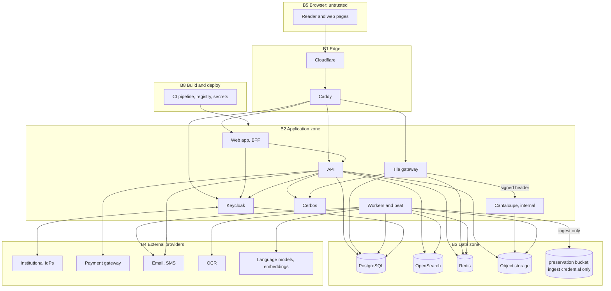

# Threat model

Status: derived from `SPEC.md` (as of 2026-10-04) in the first session. It assumes the architecture in `docs/ARCHITECTURE.md` and the decisions accepted in `docs/decisions/ADR-0001-stack.md`. Requirement identifiers appear in square brackets. Every control names the test that proves it; test names follow the convention `test_<requirement id>_<behaviour>` so a failure traces to the requirement.

## 1. Scope and method

- System under analysis: the core layer as deployed behind Cloudflare and Caddy, with its workers, image path, identity and policy services, data stores and external providers.
- Method: STRIDE applied per trust boundary and per data flow, with the three attacker assumptions the specification names (a motivated individual extracting a full book, a compromised staff account, a hostile network) extended with the personas in section 3. Privacy threats follow a LINDDUN-style pass over personal data flows.
- Targets: OWASP ASVS 4.0 Level 2 across the platform and Level 3 for authentication, session management and access control.
- Risk rating: likelihood and impact each rated High, Medium or Low before mitigations; the "Residual" column states what remains after the listed controls.
- Maintenance: this document is updated on any change to the reader or the authorization layer, which also triggers a penetration test [SEC-21], on any new external provider or role, and on penetration-test findings. It is reviewed quarterly alongside `docs/COMPLIANCE_MATRIX.md`.

## 2. Assets

| ID | Asset | Why it matters | Priority | Where it lives |
| --- | --- | --- | --- | --- |
| A1 | Preservation masters | Irreplaceable national heritage; a leak is permanent, a corruption is forever | Integrity, confidentiality | `preservation` bucket, replica, offline copy |
| A2 | Access derivatives and any complete page set | A complete set of page images equals the book; the whole protection model exists to prevent one leaving | Confidentiality | `access` bucket, Cantaloupe, tile path |
| A3 | OCR text and ALTO | Internal only; the text of a protected book in copyable form would defeat the reader's purpose | Confidentiality | PostgreSQL `page`, OpenSearch `pages-*`, `access/alto` |
| A4 | Content objects and their review status | Trust in the institution depends on nothing AI-generated appearing unreviewed or mislabelled | Integrity | PostgreSQL `content_object`, `review_task` |
| A5 | Identity documents | Highest-sensitivity personal data, legally time-limited | Confidentiality | `uploads` bucket, `verification_case` |
| A6 | Account and behaviour data | Emails, phones, institution, reading behaviour, requests with stated purpose | Confidentiality | PostgreSQL, Keycloak, audit log |
| A7 | Payment references | Transaction references only; no card data by design | Integrity | PostgreSQL `payment` |
| A8 | Audit log | Non-repudiation for seven years; evidence in any dispute or incident | Integrity, availability | PostgreSQL `audit_event`, `audit-archive` bucket |
| A9 | Secrets and keys | Tile token keys, forensic master key, ingest credential, OIDC client secrets, provider keys, database roles | Confidentiality | Host secret store |
| A10 | Policies and configuration | A wrong policy or setting silently opens the collection | Integrity | `policies/`, images, environment |
| A11 | Catalog metadata | The institution's authority; vandalism damages trust | Integrity | PostgreSQL, OpenSearch |
| A12 | Availability of catalog and reader | Researchers and institutions depend on it; outages during a demo or a course cost trust | Availability | Whole stack |
| A13 | Rights compliance | Serving a work outside its access class exposes the institution legally | Integrity | Policies, grants, four-eyes records |

## 3. Attacker personas

| ID | Persona | Goal | Capabilities |
| --- | --- | --- | --- |
| P1 | Motivated extractor | A complete copy of a protected book, ideally untraceable | A member account or several, scripting and browser automation, token capture from their own browser, many devices and IPs, patience |
| P2 | Compromised or malicious staff account | Content, personal data, or covering tracks | Valid staff credentials from phishing or malware, possibly with the second factor; the insider variant knows the workflows |
| P3 | Hostile network | Intercept or alter traffic, reach internal services | Position on the user's network, a hostile ISP, or a foothold inside the application network after another compromise |
| P4 | Opportunistic internet attacker | Accounts, data, or disruption | Scanners, credential stuffing lists, bot farms, DDoS-for-hire |
| P5 | Misconfigured or malicious institutional identity provider | Access beyond the institution's license, or staff roles | Control of SAML or OIDC assertions for a federated institution |
| P6 | Supply-chain adversary | Code execution in build or runtime | A compromised dependency, base image, CI action or registry |
| P7 | External provider risk | Retention or training on content sent for OCR, translation or embeddings | Receives page text and images by design |
| P8 | Careless insider | None hostile; exports or shares more than needed | Legitimate access used without care |

## 4. Trust boundaries and data flows

| Boundary | Between | Crossing controls |
| --- | --- | --- |
| B1 | Internet and the edge | WAF, DDoS and bot management, TLS 1.2+ with 1.3 preferred, HSTS preload, origin accepts Cloudflare only [SEC-22, SEC-16] |
| B2 | Edge and application zone | Caddy routes only to web, API, gateway and Keycloak; security headers; request IDs; no other service has a public route [SEC-24] |
| B3 | Application and data zone | Private network or mutual TLS, per-service database roles with row-level security, per-bucket credentials, Redis authentication [SEC-7, SEC-24] |
| B4 | Application and external providers | Adapters, allowlisted providers, egress allowlist, signed callbacks, no personal data to OCR or language providers [TRN-6, ACS-3] |
| B5 | Browser | Assumed hostile: tokens short-lived and bound, no originals or text ever sent, CSP [SEC-10, SEC-13, SEC-16] |
| B6 | Public and staff surfaces | Staff routes require staff roles and MFA at the policy layer; staff portals carry the same checks as the API [SEC-3, SEC-6] |
| B7 | Ingest credential and everything else | Only the ingest worker pool holds write access to `preservation`; object lock makes writes irreversible [Preservation rules] |
| B8 | Build pipeline and runtime | Signed images pinned by digest, protected `main`, scanners as merge gates, secret scanning [SEC-18, SEC-20] |

## 5. Threat catalogue

Columns: STRIDE letter in brackets after the threat; L and I are likelihood and impact before controls.

### 5.1 Content extraction (P1, P3)

| ID | Threat | Attack path | L/I | Controls | Proving test | Residual |
| --- | --- | --- | --- | --- | --- | --- |
| T-A1 | Download an original or full derivative [I] | Find a route, manifest, bucket URL or export that returns a master, JPEG 2000 or PDF of a protected work | M/H | No route serves `preservation` or full `access` objects; buckets private; API has no preservation credential; manifests carry no download links [RDR-1, SEC-10] | `test_sec_10_no_route_serves_originals` (walks routes and storage policies), `test_rdr_1_manifest_has_no_download_links` | None by design |
| T-A2 | Reassemble a book from tiles [I] | Hold a valid grant, script the viewer, fetch every tile of every page, stitch | H/H | Per-tile grant check; 5-minute session-bound tile tokens; rate limits at reading speed with session suspension and account flag; visible and forensic marks on every tile; capped tile pixel area; device limit; behaviour analytics [SEC-10, SEC-11, SEC-12, ACS-2, RDR-6] | `test_sec_12_tile_rate_limit_suspends_session`, `test_sec_11_every_protected_tile_is_watermarked`, `test_sec_10_tile_pixel_area_capped` | A patient attacker across many sessions obtains a low-resolution, watermarked copy traceable to their account. Stated plainly to the institution |
| T-A3 | Replay or share tile URLs [S, I] | Copy tile URLs from the network panel and fetch them from another machine | H/M | Token expiry 5 minutes, binding to the reader session, `private, no-store` [SEC-10] | `test_sec_10_expired_tile_token_denied`, `test_sec_10_tile_token_bound_to_session` | A URL works for up to 5 minutes for anyone who already holds the session |
| T-A4 | Steal the grant token [S] | Cross-site scripting, browser malware, or a shared machine | M/H | Tokens in memory only, never in storage; strict CSP with nonces; 10-minute lifetime; device fingerprint binding; session list with revoke [SEC-2, SEC-5, SEC-16] | `test_sec_2_grant_token_rejected_for_other_device`, e2e `csp_blocks_inline_script` | Malware on the user's device sees what the user sees |
| T-A5 | Share one account across many devices [S] | Hand out credentials to a group | H/M | Concurrent device limit per grant; session and device list; MFA available [ACS-2, SEC-5] | `test_acs_2_device_limit_enforced` | Limit is per grant, not per person |
| T-A6 | Request pages outside the grant or sample range [E] | Change the page identifier in a tile URL | H/H | Per-tile policy check includes page range and sample range [RDR-1, SEC-6] | `test_rdr_1_tile_outside_grant_range_denied`, `test_cat_1_sample_range_enforced_per_class` | None |
| T-A7 | Reach Cantaloupe directly [E, I] | Foothold in the network, or a misrouted port | L/H | Internal network only; delegate requires the gateway's signed header valid 30 seconds; network policies [SEC-24] | `test_sec_24_cantaloupe_rejects_unsigned_request` (integration) | None without a key compromise |
| T-A8 | Full-resolution region through IIIF parameters [I] | Ask for `full/max` or a huge region at `size=max` | H/H | Gateway caps pixel area and refuses `max` for protected works; Cantaloupe `max_pixels`; `info.json` lists allowed sizes only [SEC-10] | `test_sec_10_full_max_denied_for_protected_work` | None |
| T-A9 | Abuse print [I] | Print the whole book, or at full resolution, or share the PDF URL | M/M | Quota per grant, 150 ppi, both marks, single-use 15-minute URL, deleted after download, logged with pages [RDR-4, SEC-11, SEC-15] | `test_rdr_4_print_quota_enforced`, `test_sec_15_download_url_single_use` | A quota's worth of low-resolution watermarked pages |
| T-A10 | Extract OCR text [I] | Search snippets, API fields, alignment payloads, IIIF annotations, OpenAPI fields, error messages, exports, or OpenSearch directly | H/H | Text never in any response: highlights return coordinates only; `_source` excludes text; response schemas have no text field; OpenSearch unreachable from the edge; translation alignment payloads carry segment ids and regions, not OCR lines [CAT-4, RDR-3, SRCH-4, TRN-3] | `test_cat_4_search_response_contains_no_page_text`, `test_rdr_3_reader_payloads_contain_no_text`, `test_cat_4_public_schemas_have_no_text_fields` | Staff review portal shows OCR text to Reviewers by design [ADM-8] |
| T-A11 | Learn that an embargoed or withdrawn work exists [I] | Facet counts, search totals, sitemaps, OAI-PMH, the open API, resolver response differences | M/M | Mandatory visibility filter before aggregation; uniform not-found for embargoed, withdrawn and missing identifiers; excluded from feeds [CAT-5, SEO-3, SEO-6] | `test_cat_5_facets_exclude_embargoed`, `test_cat_5_embargoed_resolves_as_not_found`, `test_seo_6_open_api_excludes_embargoed` | Staff see them by design |
| T-A12 | Edge or proxy caching of protected content [I] | A tile or private page cached at Cloudflare or Caddy and served to another user | L/H | `Cache-Control: private, no-store` on `/iiif`, `/api`, reader, account and staff paths; Cloudflare bypass rules; Cantaloupe derivative cache off for protected sources [PRF-4] | `test_prf_4_protected_responses_are_no_store`, e2e header check through the edge | None |
| T-A13 | Browser or service worker cache retains tiles [I] | Disk cache inspection | M/L | `no-store`; any service worker cache short-lived and encrypted [RDR-7] | e2e `tiles_not_persisted_in_cache_storage` | Transient copies on the user's device |
| T-A14 | Screen capture or photography [I] | Capture the displayed page | H/M | Cannot be prevented; visible and forensic marks make it traceable; deterrents [SEC-13] | Not testable; recorded as accepted | Accepted, see section 7 |
| T-A15 | Forensic key compromise defeats tracing [R] | Read the master key or session keys | L/H | Master key in the secret store; session keys encrypted at rest; access logged [SEC-11, SEC-19] | `test_sec_11_session_forensic_key_encrypted_at_rest` | None |
| T-A16 | Manifest or `info.json` of a protected work leaks structure [I] | Fetch the manifest without a grant to enumerate pages and sizes | M/L | Manifest for protected works only with a grant token; anonymous manifest covers the sample range only [RDR-1] | `test_rdr_1_protected_manifest_requires_grant` | Page count is public metadata by design |

### 5.2 Identity and sessions (P1, P3, P4, P5)

| ID | Threat | Attack path | L/I | Controls | Proving test | Residual |
| --- | --- | --- | --- | --- | --- | --- |
| T-B1 | Credential stuffing and password spraying [S] | Automated login attempts | H/M | Keycloak brute-force detection with lockout after 10 failures and exponential backoff; breached-password check; MFA; edge bot rules [SEC-4, SEC-3, ACC-1] | `test_sec_4_lockout_after_ten_failures` (realm export assertion and integration) | Residual account takeover where the user reuses an unbreached password and has no MFA |
| T-B2 | OTP interception or SIM swap [S] | Intercept SMS or port the number | M/M | SMS OTP for members only; staff use TOTP or WebAuthn; OTP attempt limits; step-up for sensitive actions [SEC-3] | `test_sec_3_staff_roles_cannot_use_sms_otp` | Member accounts remain exposed to SIM swap; mitigated by the device limit and audit |
| T-B3 | Refresh token theft and reuse [S] | Steal the BFF session store or a token in transit | L/H | Tokens server-side only; rotation with reuse detection; 8-hour and 1-hour lifetimes; TLS [SEC-2, SEC-22] | `test_sec_2_refresh_reuse_revokes_family` | None |
| T-B4 | Login cross-site request forgery or session fixation [S] | Forge the callback or pre-set a session | M/M | Authorization Code with PKCE, `state` and `nonce`, SameSite cookies, session rotated at login [SEC-1] | `test_sec_1_callback_rejects_bad_state` | None |
| T-B5 | Phishing of staff, including MFA fatigue [S] | Fake login page or push bombing | M/H | WebAuthn hardware keys for platform admins (phishing resistant); TOTP or WebAuthn for other staff; alerts on failed login spikes; short staff refresh lifetime [SEC-3, SEC-26] | `test_sec_3_platform_admin_requires_webauthn` | Non-admin staff with TOTP remain phishable; compensated by four-eyes and audit |
| T-B6 | Federation abuse: assertion forgery, replay, attribute injection to gain staff roles [S, E] | A malicious or misconfigured institutional IdP sends crafted group claims | L/H | Keycloak validates signatures, audience and timestamps; group-to-role mapping is an allowlist that maps only to Institutional user and Institution admin, never to staff roles; just-in-time provisioning scoped to the institution [ACC-4] | `test_acc_4_idp_groups_cannot_map_to_staff_roles`, `test_acc_4_jit_user_bound_to_institution` | A compromised IdP grants its own institution's license, which is the institution's risk |
| T-B7 | Account enumeration [I] | Registration, reset and OTP responses differ | H/L | Uniform responses and timing; rate limits [ACC-1] | `test_acc_1_registration_response_uniform` | None |
| T-B8 | Weak or breached passwords [S] | Guessable passwords | M/M | NIST SP 800-63B policy, length over complexity, k-anonymity breached-password check at registration and change [ACC-1, SEC-4] | `test_sec_4_breached_password_rejected` | None |
| T-B9 | Stale sessions after role change, password reset or revocation [E] | A revoked user keeps reading | M/M | Session list and revoke; staff revoke; propagation within 60 seconds through the Redis decision cache and heartbeat [SEC-5, ACS-2, RDR-5] | `test_sec_5_revocation_propagates_within_60s` | Up to 60 seconds of continued reading |
| T-B10 | Keycloak admin console exposure [E] | Public route to the admin console | L/H | Console reachable only from the internal network or through an admin-only route with hardware key MFA; realm configuration in code with drift detection [SEC-24, SEC-3] | `test_sec_24_keycloak_admin_not_public` (edge scan) | None |

### 5.3 Authorization (all personas)

| ID | Threat | Attack path | L/I | Controls | Proving test | Residual |
| --- | --- | --- | --- | --- | --- | --- |
| T-C1 | A route without a policy check [E] | A new handler forgets authorization | H/H | `Authorize` dependency on every route; route-coverage test with no allowlist; health and metrics on an internal app [SEC-6] | `test_sec_6_every_route_calls_policy_engine` | None |
| T-C2 | Insecure direct object reference [I, E] | Guess or increment identifiers | M/H | UUIDv7 never exposed; opaque public identifiers with check character; the policy check loads the resource and decides per object [SEC-6, Identifiers] | `test_sec_6_no_internal_ids_in_public_responses`, `test_sec_6_object_access_checked_per_resource` | None |
| T-C3 | Policy logic error opens a class [E] | A YAML rule allows `registered` reading to anonymous | M/H | Cerbos test suite covering every role, access class and action including every denial; schema enforcement on attributes; policies versioned and reviewed [Policy tests] | `policies/tests/*` (every combination), `test_sec_6_policy_matrix_matches_spec_table` | None |
| T-C4 | Mass assignment of privileged fields [E] | Send `review_status`, `role`, `access_class` in a create or update body | H/H | Strict Pydantic schemas with explicit fields per operation; forbid extra fields; database guard on `approved` [SEC-17, REV-1] | `test_rev_1_review_status_not_settable_via_api`, `test_sec_17_unknown_fields_rejected` | None |
| T-C5 | Four-eyes bypass [E, R] | The proposer approves their own change, or two sessions of one person | M/H | Distinct approver enforced in the service and by a database check; both principals audited [SEC-9, ADM-3] | `test_sec_9_same_principal_cannot_approve_own_proposal` | Collusion of two staff members, mitigated by audit |
| T-C6 | Break-glass abuse [E, R] | An admin reads protected content or extends their own window | L/H | Second admin approval, one-hour expiry, high-severity audit event, email to the rights officer [SEC-8] | `test_sec_8_break_glass_requires_second_admin`, `test_sec_8_break_glass_expires_in_one_hour` | Two colluding admins, visible in audit |
| T-C7 | Row-level security bypass [E] | Superuser connection, `BYPASSRLS`, or a missing `SET LOCAL` | L/H | Runtime roles without `BYPASSRLS`; session variables set in `core.db` for every transaction; migration role separate [SEC-7] | `test_sec_7_rls_blocks_cross_institution_read`, `test_sec_7_runtime_roles_cannot_bypass_rls` | None |
| T-C8 | Staff query beyond scope [I] | A curator reads identity documents or payments | M/M | Policies scoped by role; RLS on staff tables; audit per view [SEC-7, ACC-3] | `test_sec_7_curator_cannot_read_identity_documents` | None |
| T-C9 | Policy engine unavailable [D, E] | Cerbos down or erroring | L/H | Fail closed: every error is a deny; alert on policy engine error [SEC-26] | `test_sec_6_policy_engine_error_denies` | Availability loss while Cerbos is down |
| T-C10 | Policy tampering in deploy [T] | Edit policy files on a mounted volume | L/H | Policies baked into the signed image; no writable mount; CI tests gate merges [SEC-18, SEC-20] | Deployment manifest test: no writable policy volume | None |

### 5.4 Compromised staff account (P2)

| ID | Threat | Attack path | L/I | Controls | Proving test | Residual |
| --- | --- | --- | --- | --- | --- | --- |
| T-D1 | Record vandalism or silent alteration [T] | A curator edits titles, provenance or rights statements | M/M | Field-level change history; second approver for publishing and access class change; audit; withdrawn state for recovery [ADM-2, ADM-3, SEC-25] | `test_adm_2_every_field_change_recorded` | Drafts can be altered until review |
| T-D2 | Self-granting or reclassification [E] | A rights officer opens a restricted work or extends a grant for an accomplice | M/H | Four-eyes on access class, pricing and grant end date; every grant logged with reason; alert on unusual grant volume [SEC-9, ACS-1, SEC-26] | `test_sec_9_access_class_change_requires_second_approver`, `test_sec_9_grant_extension_requires_second_approver` | A single grant within normal parameters by a legitimate officer is indistinguishable from honest work; audit allows review |
| T-D3 | Harmful or wrong AI content approved [T] | A compromised reviewer approves manipulated text | L/M | Edit diff stored; reviewer identity shown on the object and in audit; withdraw path; optional second reviewer by policy [REV-2, REV-4, SRC-2] | `test_rev_4_approval_writes_audit_with_reviewer` | Public exposure until withdrawn |
| T-D4 | Platform admin exfiltration [I] | Use operator access to read masters or bulk derivatives | L/H | No content bypass without break-glass; hardware key MFA; admin holds no preservation credential; audit shipped to write-once storage [SEC-8, SEC-3, SEC-19, SEC-25] | `test_sec_8_admin_without_break_glass_denied_protected_read` | Infrastructure-level access on the host remains an institutional control |
| T-D5 | Audit tampering [R, T] | Delete or rewrite events to hide actions | L/H | Append-only privileges and trigger; hash chain; daily shipment to object-locked storage; verification job [SEC-25] | `test_sec_25_audit_rows_cannot_be_updated_or_deleted`, `test_sec_25_hash_chain_verifies` | Events between the act and the next shipment could be lost by destroying the database, which the chain head and backups reveal |
| T-D6 | Bulk personal data export [I] | A staff member exports users or requests | M/M | Signed, logged exports; role scoping; alert thresholds; retention limits [ADM-5, SEC-27] | `test_adm_5_export_is_signed_and_audited` | Authorized exports can still be misused |
| T-D7 | Rogue staff provisioning or MFA disabling [E] | Admin creates a staff account or weakens MFA | L/H | Keycloak admin limited to platform admins with hardware keys; realm settings from code with drift detection; admin events logged and alerted [SEC-3, SEC-26] | `test_sec_3_mfa_required_for_every_staff_role` (realm export assertion) | None |

### 5.5 Hostile network (P3)

| ID | Threat | Attack path | L/I | Controls | Proving test | Residual |
| --- | --- | --- | --- | --- | --- | --- |
| T-E1 | TLS downgrade or interception [I, T] | Man-in-the-middle on the user's network | M/H | TLS 1.2 minimum, 1.3 preferred, modern suites, HSTS with preload, strict TLS from Cloudflare to origin, automated certificates [SEC-22, SEC-16] | `test_sec_22_tls_configuration` (edge scan in CI), `test_sec_16_hsts_preload_header` | None short of a compromised certificate authority |
| T-E2 | DNS or routing hijack [S] | Redirect the domain | L/H | DNSSEC at Cloudflare; HSTS preload; pinned OIDC issuer in configuration [SEC-22] | Configuration assertion | Residual depends on registrar security |
| T-E3 | Lateral movement inside the application network [E] | Foothold in one container reaches databases or Cantaloupe | L/H | Private networks or mutual TLS; network policies; per-service credentials; internal endpoints require service tokens; no service public except through Caddy [SEC-24] | `test_sec_24_only_caddy_publishes_ports` (compose and k8s manifest test) | A compromised API container holds API credentials by necessity |
| T-E4 | Replay of the gateway-to-Cantaloupe header [S] | Capture the internal header and reuse it | L/M | HMAC over path and timestamp, 30-second validity [SEC-24] | `test_sec_24_internal_image_header_expires` | None |
| T-E5 | Redis or broker tampering [T] | Write fake allow decisions or tasks | L/H | Redis authentication, private network, decisions keyed by session and page with short TTL, JSON-only tasks [SEC-24] | Integration test: unauthenticated Redis connection refused | None |

### 5.6 Application-level attacks (P1, P2, P4)

| ID | Threat | Attack path | L/I | Controls | Proving test | Residual |
| --- | --- | --- | --- | --- | --- | --- |
| T-F1 | SQL injection [T, I] | Crafted search or filter input | M/H | SQLAlchemy parameterized queries only; Pydantic validation; Semgrep and Bandit gates [SEC-17, SEC-20] | Schemathesis contract run; Semgrep ruleset in CI | None |
| T-F2 | OpenSearch query injection or expensive queries [T, D] | Query DSL built from strings; leading wildcards, regular expressions, deep pagination | M/M | Queries built from typed objects; `simple_query_string` with restricted flags; timeouts; capped result window; rate limits [SEC-17, PRF-3] | `test_cat_4_search_rejects_dsl_in_query`, `test_prf_3_result_window_capped` | None |
| T-F3 | Stored cross-site scripting and bidirectional spoofing [T] | Curator-entered titles, notes or rich text with scripts or Unicode direction overrides that disguise labels | M/H | React escaping; CSP nonces; allowlist sanitizer for rich text; strip or neutralize bidirectional control characters on input; `dir="auto"` on user content [SEC-16, SEC-17, INT-2] | `test_sec_17_bidi_controls_stripped`, `test_sec_17_rich_text_sanitized`, e2e CSP check | None |
| T-F4 | Malicious image uploads [T, D] | TIFF or JPEG 2000 parser exploits, decompression bombs, polyglots in intake or identity documents | M/H | Magic bytes, size and dimension limits, re-encoding; isolated worker with resource limits; patched libvips and Cantaloupe; only staff can submit intake [SEC-17, SEC-18, ADM-1] | `test_sec_17_upload_rejects_wrong_magic_bytes`, `test_sec_17_upload_rejects_oversized_dimensions` | Zero-day in an image library inside the worker sandbox |
| T-F5 | XML external entities and entity expansion [I, D] | Crafted ALTO, METS, MODS or MARCXML | M/H | `defusedxml` or lxml with entities and DTDs disabled for every parser in `packages/metadata` [SEC-17] | `test_sec_17_xml_parsers_reject_external_entities` | None |
| T-F6 | Server-side request forgery [I] | IIIF identifiers, manifest URLs, webhook or discovery URLs pointing at internal services | M/H | Identifiers resolve by allowlist to bucket keys; no user-supplied URL is fetched; egress allowlist [SEC-17, SEC-24] | `test_sec_17_iiif_identifier_cannot_be_url` | None |
| T-F7 | Task deserialization [T] | Pickle payloads on the broker | L/H | JSON serializer only; broker authenticated [SEC-17] | `test_sec_17_celery_accepts_json_only` | None |
| T-F8 | Cross-site request forgery on BFF endpoints [S] | Cookie-authenticated state change from another site | M/M | SameSite cookies, Origin check, CSRF token on state-changing routes [SEC-16] | `test_sec_16_state_change_requires_csrf_token` | None |
| T-F9 | Clickjacking of reader or portals [S] | Frame the site | L/M | `frame-ancestors 'none'`, COOP [SEC-16] | `test_sec_16_frame_ancestors_none` | None |
| T-F10 | Open redirect in login return paths [S] | Crafted return URL after login | M/L | Relative allowlisted paths only [SEC-1] | `test_sec_1_return_path_must_be_relative` | None |
| T-F11 | Forged or replayed payment callback [S, E] | Fake success callback creates a free grant | M/H | Signature verification, server-to-server confirmation, amount and currency check, idempotency on the transaction reference [ACS-3, SEC-30] | `test_acs_3_unsigned_callback_rejected`, `test_acs_3_callback_replay_creates_one_grant` | None |
| T-F12 | Prompt injection through page text or metadata [T] | A page or record contains instructions aimed at the translation model | M/M | Model output is an untrusted content object gated by review; output constrained to the alignment schema; no tool access in pipeline prompts; glossary changes only by reviewers [REV-1, TRN-3, TRN-2] | `test_rev_1_ai_object_invisible_until_approved` | A reviewer must catch manipulated text |
| T-F13 | Glossary or vocabulary poisoning [T] | Insert wrong approved forms | L/M | Reviewer-only edits, change history, audit [TRN-2, REV-4] | `test_trn_2_glossary_edit_requires_reviewer` | None |
| T-F14 | Path traversal in storage keys [I] | Page sequence or identifier with `../` | M/H | Keys built from validated UUIDs and integers, never from input strings [SEC-17] | `test_sec_17_storage_keys_built_from_validated_parts` | None |
| T-F15 | Request smuggling or header injection [T] | Malformed requests through the proxies | L/M | Cloudflare and Caddy normalization; patched proxies [SEC-18] | Dependency scanning in CI | None |
| T-F16 | Information leakage in errors and OpenAPI [I] | Stack traces, internal ids, OCR fields in schemas | M/M | RFC 9457 errors with codes only; `DEBUG` refused outside local; internal routes excluded from the public document [SEC-17] | `test_sec_17_errors_contain_no_internals`, `test_sec_19_debug_refused_in_production_config` | None |

### 5.7 Availability (P1, P4)

| ID | Threat | Attack path | L/I | Controls | Proving test | Residual |
| --- | --- | --- | --- | --- | --- | --- |
| T-G1 | Volumetric denial of service [D] | Flood the edge | M/M | Cloudflare DDoS protection; origin accepts only Cloudflare [Edge] | Edge configuration review | Cloud-scale attacks are Cloudflare's to absorb |
| T-G2 | Authenticated tile floods [D] | Many sessions hammering the gateway | M/M | Rate limits per user and per IP, session suspension, flagging [SEC-12] | `test_sec_12_ip_rate_limit_independent_of_user` | None |
| T-G3 | Expensive search abuse [D] | Semantic queries at volume | M/M | Rate limits, cached query embeddings, timeouts, capped windows [PRF-3] | `test_prf_3_search_rate_limited` | None |
| T-G4 | Queue starvation [D] | OCR or translation jobs block fixity and mail | M/L | Separate queues and worker pools, per-queue concurrency, priorities [Background processing] | Compose configuration test | None |
| T-G5 | Provider cost exhaustion [D] | Runaway jobs call OCR or language providers | M/M | Per-job budgets, quotas, circuit breakers, alerts [SEC-26] | `test_trn_4_retry_limit_escalates_to_human` | None |
| T-G6 | Storage exhaustion [D] | Uploads or exports fill a bucket or disk | L/M | Size limits, lifecycle rules, quotas, growth alerts [Storage layout] | Bucket lifecycle assertion | None |
| T-G7 | Redis loss [D] | Cache or broker unavailable | L/M | Gateway falls back to database checks with an in-memory rate limiter; tasks retry; readers degrade, never open up [SEC-12] | `test_sec_10_redis_outage_fails_closed_not_open` | Slower tiles during an outage |
| T-G8 | Ransomware or deletion of buckets [D, T] | Compromised credential deletes or encrypts objects | L/H | Object lock and versioning on preservation and audit archive; replication; offline copy; separate credentials per bucket [Preservation rules, SEC-19] | Bucket policy assertion; quarterly restore drill | Access bucket is regenerable from masters |

### 5.8 Privacy and compliance (P2, P8)

| ID | Threat | Attack path | L/I | Controls | Proving test | Residual |
| --- | --- | --- | --- | --- | --- | --- |
| T-H1 | Identity documents retained or over-exposed [I] | Documents kept beyond the law, or viewable by the wrong role | M/H | Dedicated bucket and key; deletion 30 days after decision by scheduled job and lifecycle rule; Rights officer only; audit per view; never in logs [ACC-3, SEC-23, SEC-27] | `test_acc_3_identity_documents_deleted_30_days_after_decision`, `test_acc_3_only_rights_officer_views_documents` | None |
| T-H2 | Reading behaviour misuse [I] | Analytics used for profiling or advertising | L/M | Purpose limitation to audit; scoped access; retention per `ADR-0001 D16` [RDR-6, SEC-28] | `test_rdr_6_reader_analytics_stored_in_audit_only` | None |
| T-H3 | Tokens or personal data in logs [I] | Logging a request with a bearer token or a document | M/M | Structured logging with a redaction filter; log assertions in tests [SEC-27] | `test_sec_27_logs_never_contain_tokens` | None |
| T-H4 | Deletion request conflicts with audit retention [R] | Deleting a user erases evidence, or audit blocks deletion | M/M | Pseudonymize the user record and keep audit with an opaque actor id; documented in the privacy notice [ACC-5, SEC-27, SEC-28] | `test_acc_5_deletion_pseudonymizes_and_keeps_audit` | None |
| T-H5 | Personal data sent to external providers [I] | OCR or translation requests carrying user data | L/M | Only page text and metadata go to providers; no user fields; no-training terms; processing records [TRN-6, SEC-29] | `test_trn_6_provider_payload_contains_no_user_data` | Page text itself leaves the platform by design, under contract |
| T-H6 | Late or missing breach notification [R] | No procedure | L/H | Incident runbook with the legal window and the data protection contact [SEC-28] | Runbook review | None |
| T-H7 | Marketing without consent [R] | Default opt-in | L/L | Consent flag for marketing only, separate from transactional notices [SEC-28] | `test_sec_28_marketing_requires_consent` | None |

### 5.9 Supply chain and build (P6)

| ID | Threat | Attack path | L/I | Controls | Proving test | Residual |
| --- | --- | --- | --- | --- | --- | --- |
| T-I1 | Compromised dependency [T] | Malicious package version | M/H | Lockfiles; pip-audit and npm audit; Trivy; monthly update window; minimal base images; SBOM [SEC-18] | CI gates | Zero-day in a pinned dependency until the next window |
| T-I2 | Tampered image [T] | Registry compromise | L/H | Signed images, digest pinning, signature verification at deploy [Deployment] | Deployment manifest test | None |
| T-I3 | CI secret leak [I] | Secrets in logs or forks | M/H | Least-privilege CI credentials; secret scanning; no secrets in environment files [SEC-19] | Secret scanning in CI | None |
| T-I4 | Malicious or careless pull request [T] | Policy or route change merged without review | M/H | Protected `main`, required review, all gates including route coverage, policy tests and Semgrep [SEC-20] | Branch protection review | None |
| T-I5 | Third-party scripts or fonts [T] | Remote script changes under the attacker's control | L/M | Self-hosted fonts, no third-party JavaScript, CSP [SEC-16, PRF-5] | `test_sec_16_csp_has_no_remote_script_sources` | None |

### 5.10 Preservation integrity (P2, P6, nature)

| ID | Threat | Attack path | L/I | Controls | Proving test | Residual |
| --- | --- | --- | --- | --- | --- | --- |
| T-J1 | Bit rot or silent corruption [T] | Storage media error | L/H | SHA-256 at ingest; quarterly fixity; incident and freeze from public view on mismatch [Preservation rules] | `test_fixity_mismatch_opens_incident_and_freezes_object` | Corruption between checks is caught at the next check and repaired from the replica |
| T-J2 | Accidental overwrite or deletion of masters [T] | Operator error | L/H | Object lock in compliance mode; versioning; no delete credential in any application role [Preservation rules] | Bucket policy assertion | None |
| T-J3 | Ingest credential leak [T] | Credential used to write bad masters | L/H | Scoped to write-once paths; held only by the ingest worker pool; rotated yearly; alerts on unexpected writes [SEC-19] | `test_preservation_write_requires_ingest_credential` | Bad new objects can be added, never existing ones changed |
| T-J4 | Derivative tampering [T] | Swap a page image in the access bucket | L/M | Derivative checksums recorded; fixity covers derivatives; regenerable from masters [Preservation rules] | `test_fixity_covers_derivatives` | None |
| T-J5 | Loss of the ability to rebuild [D] | Software or format obsolescence | L/H | METS plus PostgreSQL export as the restore unit; quarterly restore drill recorded [Preservation rules] | Restore drill record | None |

### 5.11 AI content integrity (P1, P2, P7)

| ID | Threat | Attack path | L/I | Controls | Proving test | Residual |
| --- | --- | --- | --- | --- | --- | --- |
| T-K1 | AI object visible before approval [T, I] | A query path, index or panel forgets the status filter | M/H | Created at `pending`; API filter for non-staff; database guard on the transition; search index and reader panel show approved only [REV-1, SRC-2] | `test_rev_1_ai_object_invisible_until_approved` (the zero-leak gate), `test_rev_1_db_guard_blocks_direct_approval` | None |
| T-K2 | Provider retains or trains on content [I] | Data sent to a provider without no-training terms | M/M | Provider allowlist with declared terms; configuration refuses others; adapter metadata recorded per object [TRN-6] | `test_trn_6_training_provider_refused_in_production` | Contractual, not technical |
| T-K3 | Hallucinated or wrong translation read as authoritative [T] | Fluent but wrong output | M/M | Labels on every frame; reviewer gate; self-assessment score; citations point to the scan [SRC-1, SRC-3, TRN-4] | `test_src_1_ai_objects_labelled_with_model_and_reviewer` | Reviewer error |
| T-K4 | Embedding or index poisoning through OCR corrections [T] | Wrong corrections skew search | L/L | Curator-only corrections, versioned; tracked re-embedding [SRCH-6, ADM-2] | `test_srch_6_model_change_triggers_reembedding` | None |

## 6. Control catalogue and proving tests

| Control | Where implemented | Proving test | Phase |
| --- | --- | --- | --- |
| SEC-1 OIDC code flow with PKCE, API never sees a password | Keycloak realm, web BFF, API token verification | `test_sec_1_api_has_no_password_route`, `test_sec_1_callback_rejects_bad_state` | 0 |
| SEC-2 Token lifetimes, rotation, grant token binding | Realm export, `reader` module | `test_sec_2_realm_token_lifetimes`, `test_sec_2_grant_token_rejected_for_other_device` | 0, 1 |
| SEC-3 MFA mandatory for staff, hardware keys for admins | Realm export, policies | `test_sec_3_mfa_required_for_every_staff_role`, `test_sec_3_platform_admin_requires_webauthn` | 0, 1 |
| SEC-4 Lockout and breached-password check | Realm export | `test_sec_4_lockout_after_ten_failures`, `test_sec_4_breached_password_rejected` | 1 |
| SEC-5 Session list, revoke, 60-second propagation | `identity`, `reader`, Redis | `test_sec_5_revocation_propagates_within_60s` | 1 |
| SEC-6 Every route calls the policy engine | `core.authz`, route-coverage test | `test_sec_6_every_route_calls_policy_engine` | 0 |
| SEC-7 Row-level security | Migrations, `core.db` | `test_sec_7_rls_blocks_cross_institution_read` | 0 |
| SEC-8 Break-glass | `admin` module | `test_sec_8_break_glass_requires_second_admin` | 2 |
| SEC-9 Four-eyes | `admin`, `access`, `catalog` services | `test_sec_9_same_principal_cannot_approve_own_proposal` | 2 |
| SEC-10 Tiles only, signed 5-minute tile tokens | Tile gateway | `test_sec_10_no_route_serves_originals`, `test_sec_10_expired_tile_token_denied` | 1 |
| SEC-11 Visible and forensic watermarks, traceable keys | Tile gateway, print worker | `test_sec_11_every_protected_tile_is_watermarked`, `test_sec_11_session_forensic_key_encrypted_at_rest` | 1 |
| SEC-12 Tile rate limits with suspension | `core.ratelimit`, gateway | `test_sec_12_tile_rate_limit_suspends_session` | 1 |
| SEC-13 Reader deterrents and CSP | Web reader | e2e `reader_blocks_context_menu_and_selection` | 1 |
| SEC-14 Platform mark on samples and open works | Tile gateway | `test_sec_14_sample_tiles_carry_platform_mark` | 1 |
| SEC-15 Single-use 15-minute download URLs | `reader.printing` | `test_sec_15_download_url_single_use` | 1 |
| SEC-16 Security headers and CSP | Caddy, web middleware | `test_sec_16_security_headers_present`, e2e CSP | 0 |
| SEC-17 Input validation, uploads, parsers | Schemas, `ingest`, `packages/metadata` | `test_sec_17_unknown_fields_rejected`, `test_sec_17_upload_rejects_wrong_magic_bytes`, `test_sec_17_xml_parsers_reject_external_entities` | 0, 3 |
| SEC-18 Lockfiles and scanning | CI | pip-audit, npm audit, Trivy gates | 0 |
| SEC-19 Secrets outside git, validated configuration | `core.config`, deployment | `test_sec_19_config_refuses_insecure_values`, secret scanning | 0 |
| SEC-20 Static analysis gates | CI | Semgrep, Bandit, ESLint security | 0 |
| SEC-21 Penetration test | External | Report in `docs/operations` | 4 |
| SEC-22 TLS configuration | Caddy, Cloudflare | `test_sec_22_tls_configuration` | 0 |
| SEC-23 Encryption at rest, dedicated key for identity documents | Storage and database configuration | Bucket encryption assertion | 0, 1 |
| SEC-24 Internal traffic isolation | Compose networks, k8s network policies, signed internal header | `test_sec_24_only_caddy_publishes_ports`, `test_sec_24_cantaloupe_rejects_unsigned_request` | 0, 1 |
| SEC-25 Audit of every sensitive action, hash chain, write-once shipping | `core.audit`, maintenance job | `test_sec_25_hash_chain_verifies`, `test_sec_25_protected_read_writes_audit` | 0, 1 |
| SEC-26 Alerts | Observability stack | Alert rule tests | 1, 4 |
| SEC-27 Retention and log hygiene | Logging, maintenance | `test_sec_27_logs_never_contain_tokens` | 0 |
| SEC-28, SEC-29 Data protection law and GDPR | Privacy notice, consent flags, runbooks | `test_sec_28_marketing_requires_consent`, `test_acc_5_deletion_pseudonymizes_and_keeps_audit` | 1, 2 |
| SEC-30 PCI DSS avoided | Hosted payment page adapter | `test_sec_30_payment_record_has_no_card_fields` | 2 |
| SEC-31 ISO 27001 mapping | `docs/COMPLIANCE_MATRIX.md` | Document review | 4 |
| REV-1 AI objects invisible until approved | `content`, `review`, database guard | `test_rev_1_ai_object_invisible_until_approved` | 0 model, 3 portal |
| RDR-1 No original ever sent | Gateway, API | `test_rdr_1_manifest_has_no_download_links`, `test_rdr_1_tile_outside_grant_range_denied` | 1 |
| CAT-4, RDR-3 OCR text never returned | `search`, `reader` | `test_cat_4_search_response_contains_no_page_text`, `test_rdr_3_reader_payloads_contain_no_text` | 1 |

## 7. Residual and accepted risks

Stated plainly, as the specification requires, for the institution to accept.

1. Screen capture or photography of a displayed page cannot be prevented in a browser. Watermarks make a leak traceable, not impossible.
2. A patient attacker with a legitimate grant can accumulate a watermarked, low-resolution copy of a book over many sessions. Rate limits make it slow, suspension and flagging make it visible, and the forensic mark ties every tile to the account.
3. Member accounts may use SMS one-time passwords, which SIM swapping defeats. Staff accounts never do.
4. Keeping OCR text internal removes the text alternative screen-reader users rely on for scanned pages. This is an accessibility limitation to decide with the institution [ACX-3].
5. Arabic OCR on historic or degraded print needs human correction before search and translation are reliable.
6. Translation throughput is set by reviewer capacity, not by the model.
7. Collusion between two staff members defeats four-eyes controls; audit makes it visible after the fact.
8. Up to 60 seconds of continued reading after a revocation, by design of the cache.
9. A zero-day in an image parsing library inside the derivatives worker is contained by the worker's isolation, not prevented.

## 8. Assumptions

- Cloudflare fronts every environment but local, and the origin accepts only Cloudflare addresses.
- Staff devices are managed by the institution and hardware keys are issued to platform admins.
- Every external provider has a data processing agreement and no-training terms before it is enabled in production.
- The host, container runtime and cloud account are operated securely by the institution or its provider; host-level compromise is outside this model.
- The browser is hostile. No control in this document relies on client-side behaviour.

## 9. Out of scope

The later layers (immersive reader, scene generation, educational products); the physical security of the library and its scanning room; the security of partner institutions' identity providers beyond what Keycloak validates; the internals of Cloudflare and the payment gateway.
